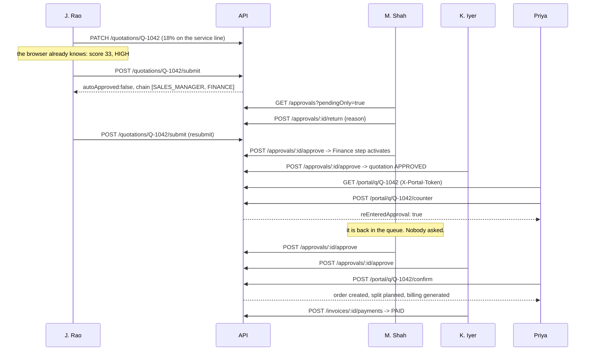

# API contract

Base path **`/api/v1`**. Frozen after Phase 3 — changes need an entry in
`CONTRACT_CHANGELOG.md`.

Live inventory of what is wired: `GET /api/v1/_routes`.
Per-module status, including what is still to build and who owns it:
`GET /api/v1/<module>/_health`.

## Conventions

**Every response** uses the same envelope:

```json
{ "success": true, "data": {}, "error": null, "meta": {} }
```

```json
{
  "success": false,
  "data": null,
  "error": { "code": "VALIDATION_ERROR", "message": "…", "details": [] }
}
```

- **Auth:** `Authorization: Bearer <jwt>` for everything internal.
- **Portal:** `X-Portal-Token: <token>` (or `?token=`) for `/portal/*`. The two
  are never sent together — the portal is a separate surface, not a header swap.
- **Ids** are strings on the wire, never raw ObjectIds.
- **Money** is an integer count of minor units (cents). `120000` is `$1,200.00`.
- **Dates** are ISO-8601 UTC strings.
- **Percentages** are numbers, not fractions: `12` means 12%.
- **Pagination:** `?page=1&pageSize=25`; `meta` carries `page`, `pageSize`,
  `total`, `totalPages`. Out-of-range values are clamped (`page` to ≥ 1,
  `pageSize` to 1…200) rather than rejected, so a stale link degrades instead of
  erroring.
- **Search:** `?q=`. `total` is the size of the **filtered** set, so a paginator
  reading it stays correct while a search is active.

### Every list endpoint searches and pages

This is a contract, not a per-module choice — see `apps/api/src/utils/listQuery.ts`,
which every list handler goes through:

| Endpoint | `?q=` matches on |
| --- | --- |
| `GET /quotations`, `GET /quotations/board` | number · customer · owner |
| `GET /approvals` | quotation number · customer · owner |
| `GET /invoices` | number · customer · order number |
| `GET /subscriptions` | number · customer · plan |
| `GET /deal-health` | quotation number · customer · owner · issue |
| `GET /products`, `GET /products/dashboard` | name · SKU · description |
| `GET /customers` | name · contact email |
| `GET /pricelists` · `/warehouses` · `/subscription-plans` | name (and code) |
| `GET /fulfillment` | warehouse · product · order number · customer |
| `GET /portal/quotations` | number · line item |

Three rules the helper enforces so no module has to remember them:

1. **Search terms are literal.** Regex metacharacters are escaped, so `?q=.*`
   matches the string `.*` and never every row in the collection.
2. **Paged sorts are total.** Every paged query sorts by its key **plus `_id`**.
   Mongo's `skip`/`limit` is only stable over a total order; sorting on a
   non-unique key alone (`lastActivityAt`, `name`) lets tied documents move
   between pages, so page 2 repeats a row from page 1 and drops another.
3. **Aggregates count the whole set, never the page.** The Deal Health tiles,
   the product-catalogue tiles and the approval/invoice/subscription status
   chips are whole-collection counts; only the table under them is filtered
   and paged.

Two endpoints carry two lists in one payload and so page each independently:

- `GET /fulfillment` — `?stockPage=` / `?awaitingPage=` with one shared `?q=`;
  `meta.stock` and `meta.awaiting` each carry a full pagination block.
- `GET /quotations/board` — grouped by stage rather than paged, so each column
  returns at most `?cardsPerColumn=` (default 25) cards plus its true `cardCount`.

### Error codes

| Code                   | HTTP | When                                            |
| ---------------------- | ---- | ----------------------------------------------- |
| `VALIDATION_ERROR`     | 400  | the body or query did not match the schema      |
| `UNAUTHENTICATED`      | 401  | missing, invalid or expired JWT                 |
| `FORBIDDEN`            | 403  | authenticated, but not allowed                  |
| `NOT_FOUND`            | 404  | no such record, or no such route                |
| `CONFLICT`             | 409  | a unique constraint was violated                |
| `STALE_VERSION`        | 409  | the quotation changed while you were editing it |
| `INSUFFICIENT_STOCK`   | 409  | an allocation asked for more than is available  |
| `INVALID_STATE`        | 409  | the action is not legal from the current state  |
| `PORTAL_TOKEN_INVALID` | 403  | unknown or revoked portal token                 |
| `PORTAL_TOKEN_EXPIRED` | 403  | the magic link has expired                      |
| `INTERNAL_ERROR`       | 500  | anything unhandled                              |

**Status legend:** ✅ implemented · 🔨 owned by an agent, not built yet

---

## Health — platform

| M   | Path                | Auth | Status |
| --- | ------------------- | ---- | ------ |
| GET | `/health`           | none | ✅     |
| GET | `/_routes`          | none | ✅     |
| GET | `/<module>/_health` | none | ✅     |

```json
{
  "success": true,
  "data": {
    "status": "ok",
    "uptimeSeconds": 19,
    "mongo": "connected",
    "timestamp": "2026-09-05T08:05:37.904Z"
  },
  "error": null
}
```

---

## Auth — platform · screen 1

| M    | Path                  | Auth | Request         | Response           | Status |
| ---- | --------------------- | ---- | --------------- | ------------------ | ------ |
| POST | `/auth/login`           | none | `LoginRequest`          | `AuthSessionDto`   | ✅     |
| POST | `/auth/change-password` | any  | `ChangePasswordRequest` | `UserDto`          | ✅     |
| GET  | `/auth/me`              | any  | —                       | `UserDto`          | ✅     |
| GET  | `/auth/demo-accounts` | none | —               | `DemoAccountDto[]` | ✅     |

`POST /auth/login`

```json
{ "email": "rep@dealflow360.test", "password": "Demo@123" }
```

```json
{
  "success": true,
  "error": null,
  "data": {
    "token": "eyJhbGciOiJIUzI1NiIsInR5cCI6IkpXVCJ9…",
    "expiresAt": "2026-09-05T20:05:37.000Z",
    "user": {
      "id": "a10002000000000000000000",
      "name": "J. Rao",
      "email": "rep@dealflow360.test",
      "role": "SALES_REP",
      "active": true,
      "landingRoute": "/app/dashboard"
    }
  }
}
```

A customer login also carries `portalQuotationId`, so the portal can open a live
quotation straight away: the quotation their most recent unrevoked magic link
points at, or — with no live link — their company's most recently active
non-draft quotation. The full list is one call away at `GET /portal/quotations`.

`GET /auth/demo-accounts` returns `[]` unless `SHOW_DEMO_LOGINS=true`.
Errors: `401 UNAUTHENTICATED` on a bad pair — identical message either way, so
nothing leaks about which half was wrong.

**There is no `POST /auth/signup`.** A public signup endpoint lets anyone mint
themselves an ADMIN, or attach a portal account to a company they have nothing to
do with. Accounts are created by an Admin on `POST /users` (screen 19), which is
audited and validates the company link. See D-021.

`POST /auth/change-password` is the account holder setting their **own**
password: it takes no id — so it cannot be pointed at another account — and it
requires the current password. It clears `mustChangePassword`, which is what
stops the first-sign-in prompt from reappearing. `400` on a wrong current
password, or on a new password identical to the old one.

**Every guarded request re-reads the account.** `requireAuth` verifies the JWT
*and* then loads the user: a missing or inactive account is `401`, and the role
enforced is the one in the database, not the one the token was minted with. A JWT
is a bearer token that cannot be recalled, so without this an account deactivated
on screen 19 would keep working until its token expired, and a demoted user would
keep the rights they had when they signed in. The cost is one indexed lookup per
authenticated request.

---

## Configuration — governance · screen 18

| M   | Path                                       | Auth                 | Request                       | Response                                  | Status |
| --- | ------------------------------------------ | -------------------- | ----------------------------- | ----------------------------------------- | ------ |
| GET | `/config`                                  | any                  | —                             | `ApprovalChainConfigDto`                  | ✅     |
| PUT | `/config`                                  | ADMIN, SALES_MANAGER | `UpdateApprovalConfigRequest` | `ConfigChangeImpactDto`                   | ✅     |
| GET | `/config/allowed-discount?tier=&category=` | any                  | —                             | `{tierCeiling, categoryCeiling, allowed}` | ✅     |

`PUT /config` — **this is the endpoint that proves nothing is hardcoded.**

```json
{
  "tierCeilings": { "GOLD": 20 },
  "categoryCeilings": { "SERVICES": 20 },
  "reason": "Q4 pricing policy — services discretion raised"
}
```

```json
{
  "success": true,
  "error": null,
  "data": {
    "config": { "…": "the saved configuration" },
    "reevaluated": [
      {
        "quotationId": "b11042000000000000000000",
        "quotationNumber": "Q-1042",
        "previousScore": 33,
        "previousLevel": "HIGH",
        "newScore": 0,
        "newLevel": "NONE",
        "autoApproved": true
      }
    ]
  },
  "meta": { "reevaluatedCount": 4 }
}
```

It re-prices and re-scores every open quotation, auto-approves any that no longer
need a human (closing their pending approval with an explanatory trail entry),
and writes one audit entry. `reason` is mandatory.

Errors: `400` if `reason` is missing · `404` if governance has never been saved.

---

## Catalogue and accounts — catalogue & platform

| M          | Path                              | Auth  | Response                | Status |
| ---------- | --------------------------------- | ----- | ----------------------- | ------ |
| GET        | `/products`                       | any   | `ProductDto[]`          | ✅     |
| GET        | `/products/:id`                   | any   | `ProductDto`            | ✅     |
| GET        | `/products/dashboard`             | any   | `ProductDashboardDto`   | ✅     |
| GET        | `/products/:id/stock`             | any   | `ProductStockDto`       | ✅     |
| POST       | `/products`                       | ADMIN | `ProductDto`            | ✅     |
| PUT        | `/products/:id`                   | ADMIN | `ProductDto`            | ✅     |
| GET        | `/pricelists` · `/pricelists/:id` | any   | `PriceListDto`          | ✅     |
| PUT        | `/pricelists/:id`                 | ADMIN | `PriceListDto`          | ✅     |
| GET        | `/warehouses` · `/warehouses/:id` | any   | `WarehouseDto`          | ✅     |
| POST · PUT | `/warehouses` · `/warehouses/:id` | ADMIN | `WarehouseDto`          | ✅     |
| GET        | `/subscription-plans`             | any   | `SubscriptionPlanDto[]` | ✅     |
| POST       | `/subscription-plans`             | ADMIN | `SubscriptionPlanDto`   | ✅     |
| GET        | `/customers` · `/customers/:id`   | any   | `CustomerDto`           | ✅     |
| GET        | `/users?role=&customerId=&active=` | ADMIN | `UserListDto`          | ✅     |
| GET        | `/users/:id`                      | ADMIN | `UserDto`               | ✅     |
| POST       | `/users`                          | ADMIN | `CreateUserRequest`     | `UserDto` · ✅ |
| PATCH      | `/users/:id`                      | ADMIN | `UpdateUserRequest`     | `UserDto` · ✅ |

Filters: `/products?category=&status=&q=` · `/customers?tier=&ownerId=&q=` ·
`/users?role=&customerId=&active=&q=`

**First sign-in.** `UserDto.mustChangePassword` is true while an account is still
on the password whoever created it typed. `POST /users` sets it (default `true`,
overridable), an Admin password reset re-arms it, and
`POST /auth/change-password` clears it. The UI *offers* the change at sign-in
rather than blocking on it — **Skip for now** leaves the flag set, so the offer
returns next time. Making it mandatory would be a guard on this same flag; that
is deliberately not what ships. See D-036.

**Users (screen 19).** `POST /users` is the only way an account is created.
`customerId` is **required** when `role` is `CUSTOMER` — a portal login is scoped
to exactly one company for its whole life — and **refused** for every internal
role (`400`). The company must exist and be active. `PATCH /users/:id` may rename,
deactivate, change an internal role, or move a portal login to another company;
it refuses to convert an account between internal and portal (that would strand
the quotations and audit entries already naming it), to deactivate your own
account, or to remove the last active Admin. It also renames, changes the email
(`409` on one already in use) and resets the password — `password` on `PATCH` is
an **Admin reset**, which deliberately does not ask for the current password,
because an Admin resetting a forgotten one does not have it. A reset writes a
`USER_PASSWORD_RESET` audit entry; the password itself is never in the audit
before/after.

Neither read returns `passwordHash`: the projection keeps it in Mongo and
`toUserDto` strips it again. These endpoints do **not** use `mountReadonly`,
precisely because that serialises the raw document.

`GET /products/:id/stock` answers for **every** product, so screen 17 can ask
without branching first: a category that is never shelved (SERVICES,
SUBSCRIPTION) comes back `stocked: false` with an empty `warehouses` list rather
than a 404. For HARDWARE it lists every ACTIVE warehouse — including those with
no `Stock` row, at zero — plus any inactive warehouse still holding units.

`POST /products` takes an optional `warehouseStock: [{warehouseId, inStock}]`,
which is how a hardware product is created **with** its opening stock. It is
rejected (400) for a category that is not stocked, and rejected on `PUT` too:
every later movement goes through `POST /stock/adjust`, the one path that writes
a reason into the audit trail. When allocations are supplied the product's
`quantityOnHand` is set to their sum, so the catalogue figure and the warehouses
cannot disagree on day one.

---

## Quotations — quotations · screens 2, 3, 4

| M     | Path                          | Auth            | Request                    | Response                    | Status |
| ----- | ----------------------------- | --------------- | -------------------------- | --------------------------- | ------ |
| GET   | `/quotations`                 | any             | `QuotationListQuery`       | `QuotationDto[]`            | ✅     |
| GET   | `/quotations/:id`             | any             | —                          | `QuotationDto`              | ✅     |
| GET   | `/quotations/board`           | any             | `?ownerId=`                | `KanbanBoardDto`            | ✅     |
| GET   | `/quotations/dashboard`       | any             | —                          | `SalesDashboardDto`         | ✅     |
| GET   | `/quotations/:id/audit`       | any             | —                          | `AuditLogDto[]`             | ✅     |
| POST  | `/quotations`                 | REP, MGR, ADMIN | `CreateQuotationRequest`   | `QuotationDto`              | ✅     |
| PATCH | `/quotations/:id`             | REP, MGR, ADMIN | `UpdateQuotationRequest`   | `QuotationDto`              | ✅     |
| POST  | `/quotations/preview`         | REP, MGR, ADMIN | `PreviewQuotationRequest`  | `QuotationPreviewDto`       | ✅     |
| POST  | `/quotations/:id/submit`      | REP, MGR, ADMIN | —                          | `SubmitQuotationResponse`   | ✅     |
| POST  | `/quotations/:id/portal-link` | REP, MGR, ADMIN | `ReissuePortalLinkRequest` | `ReissuePortalLinkResponse` | ✅     |

**Role scoping (read side).** `GET /quotations` and `GET /quotations/board` are
scoped to what the caller may see before any query filter is applied. Only
FINANCE is narrowed today: they see `APPROVED`, `NEGOTIATION` and `CONFIRMED`
only — the deals that cleared approval, confirmed ones included, since those are
what invoices are raised against. Drafts, quotes still awaiting a Sales Manager,
and rejected ones are not their queue. A hand-typed `?stage=DRAFT` narrows within
that scope and returns an empty page rather than widening it, and the board drops
the lanes the role cannot fill instead of rendering them empty. The stage set is
`FINANCE_QUOTATION_STAGES` in `packages/shared`; the filters live in
`apps/api/src/utils/roleScope.ts`. `GET /quotations/:id` is **not** scoped, so a
link from an invoice or an audit entry still resolves.

`PATCH /quotations/:id` — **must** send the `version` last read.

`POST /quotations/:id/portal-link` (Phase E) — reissue the customer's magic link.
Revokes **every** non-revoked `PortalToken` for the quotation and mints one fresh
14-day link for the customer's portal contact. `409 INVALID_STATE` for a `DRAFT`
or `REJECTED` quotation. Response: `{ token, url: "/portal/q/<number>?token=…",
expiresAt, revokedCount }`.

```json
{
  "version": 3,
  "lines": [
    { "id": "Q-1042-L1", "productId": "a30001…", "qty": 2, "discountPct": 12 },
    { "productId": "a30002…", "qty": 1, "discountPct": 18 }
  ]
}
```

A line with no `id` is added; an omitted line is removed. A stale `version`
returns `409 STALE_VERSION`.

`POST /quotations/:id/submit` — the single most important write in the product.
It recomputes the blended risk server-side and **either** auto-approves **or**
opens the approval chain. The rep never chooses.

```json
{
  "success": true,
  "error": null,
  "data": {
    "quotation": { "stage": "PENDING_APPROVAL", "…": "…" },
    "approval": {
      "id": "b21042…",
      "status": "PENDING",
      "currentStage": "SALES_MANAGER",
      "assignedToName": "M. Shah",
      "steps": [
        { "role": "SALES_MANAGER", "status": "ACTIVE" },
        { "role": "FINANCE", "status": "PENDING" }
      ]
    },
    "autoApproved": false,
    "risk": {
      "riskScore": 33,
      "riskLevel": "HIGH",
      "requiredChain": ["SALES_MANAGER", "FINANCE"],
      "blendedOverPct": 1.26,
      "maxSingleOver": 8,
      "explanation": [
        {
          "lineId": "Q-1042-L1",
          "line": "Laptop Pro 14",
          "category": "HARDWARE",
          "given": 12,
          "allowed": 15,
          "overBy": 0,
          "status": "OK",
          "weight": 0.84
        },
        {
          "lineId": "Q-1042-L2",
          "line": "Onsite Setup Service",
          "category": "SERVICES",
          "given": 18,
          "allowed": 10,
          "overBy": 8,
          "status": "OVER",
          "weight": 0.16
        }
      ],
      "summary": "1 of 2 lines exceed their own limit. Worst line is …"
    }
  }
}
```

When risk is 0: `autoApproved: true`, `approval: null`, stage `APPROVED`.

---

## Pricing, risk and upsell — quotations

| M    | Path                               | Auth | Request                 | Response                | Status |
| ---- | ---------------------------------- | ---- | ----------------------- | ----------------------- | ------ |
| POST | `/pricing/preview`                 | any  | `{customerId, lines[]}` | priced lines + totals   | ✅     |
| POST | `/risk/preview`                    | any  | `{customerId, lines[]}` | `RiskAssessmentDto`     | ✅     |
| GET  | `/upsell/suggestions?quotationId=` | any  | —                       | `UpsellSuggestionDto[]` | ✅     |

```json
[
  {
    "productId": "a30005…",
    "name": "Wireless Mouse",
    "sku": "WM-001",
    "category": "HARDWARE",
    "unitPrice": 3000,
    "marginDelta": 1800,
    "reason": "Bought alongside Laptop Pro 14 in 78% of past deals; adds 1800 minor units of margin.",
    "score": 0.69
  }
]
```

> The preview endpoints exist so the server can _confirm_ the client's optimistic
> numbers, not so the client can ask for them. The Angular builder computes
> totals, margin and risk locally from the same shared pure functions, and only
> reconciles on save.

---

## Approvals and audit — approvals · screens 5, 6

| M    | Path                                | Auth                 | Request             | Response            | Status |
| ---- | ----------------------------------- | -------------------- | ------------------- | ------------------- | ------ |
| GET  | `/approvals`                        | MGR, FIN, ADMIN, REP | `ApprovalListQuery` | `ApprovalListDto`   | ✅     |
| GET  | `/approvals/:id`                    | MGR, FIN, ADMIN, REP | —                   | `ApprovalDto`       | ✅     |
| GET  | `/approvals/:id/trail`              | MGR, FIN, ADMIN, REP | —                   | `{trail, auditLog}` | ✅     |
| POST | `/approvals/:id/approve`            | MGR, FIN             | `{reason}`          | `ApprovalDto`       | 🔨   |
| POST | `/approvals/:id/return`             | MGR, FIN             | `{reason}`          | `ApprovalDto`       | 🔨   |
| POST | `/approvals/:id/reject`             | MGR, FIN             | `{reason}`          | `ApprovalDto`       | 🔨   |
| GET  | `/audit?entity=&entityId=&actorId=` | any                  | —                   | `AuditLogDto[]`     | ✅     |

**Role scoping (read side).** `GET /approvals` shows FINANCE only the approvals
that actually *reached* Finance — the Finance step is ACTIVE now, or they already
decided it. A MEDIUM-risk quote routed to `[SALES_MANAGER]` alone never involves
them, and a HIGH-risk one still sitting with the Manager has not reached them yet
(on a HIGH chain the Finance step stays inactive until the Manager approves). A
step that was SKIPPED by a rejection upstream never landed on their desk either.
The four `counts` chips are computed over the same scope, so the queue cannot
read "1 row, 12 Pending". Every other role still sees the whole queue.

`GET /approvals?pendingOnly=true` · `?assignedToMe=true` narrows *within* that
scope to what is sitting on the caller's desk right now. It also accepts
`?page=&pageSize=` and returns `{ page, pageSize, total, totalPages }` in `meta`
(default page size 50) — as do `GET /subscriptions` and `GET /invoices`.

All three decision endpoints require a non-empty `reason` and write an
`AuditLog`. **Approve** advances to the next step, or completes the approval and
moves the quotation to `APPROVED`. **Return** sends it back to `DRAFT`.
**Reject** is terminal.

Errors: `403` if the caller's role is not the active step · `409 INVALID_STATE`
if the approval is already decided.

---

## Portal and negotiation — portal · screen 11

**A separate surface with a separate credential.** An internal JWT is refused.

| M    | Path                         | Auth                     | Request                | Response                     | Status |
| ---- | ---------------------------- | ------------------------ | ---------------------- | ---------------------------- | ------ |
| GET  | `/portal/quotations`         | portal token or CUSTOMER | `?q=&page=&pageSize=`  | `PortalQuotationListResponse` | ✅     |
| GET  | `/portal/q/:number`          | portal token or CUSTOMER | —                      | `PortalResolveResponse` | ✅     |
| GET  | `/portal/q/:number/messages` | portal token or CUSTOMER | —                      | `NegotiationEventDto[]` | ✅     |
| POST | `/portal/q/:number/comment`  | portal token or CUSTOMER | `PortalCommentRequest` | `NegotiationEventDto`   | 🔨   |
| POST | `/portal/q/:number/counter`  | portal token or CUSTOMER | `PortalCounterRequest` | `PortalCounterResponse` | 🔨   |
| POST | `/portal/q/:number/confirm`  | portal token or CUSTOMER | —                      | `PortalConfirmResponse` | 🔨   |

`GET /portal/quotations` — **one customer, many quotations.**

`Quotation.customerId` is a plain many-to-one reference, so a company accumulates
quotations over its lifetime. This endpoint returns every one of them that has
left `DRAFT` — the same set `/portal/q/:number` will open — newest activity first,
with the company on the side:

```json
{
  "customer": { "id": "…", "name": "Beta Industries", "tier": "SILVER", "…": "…" },
  "items": [
    {
      "id": "…", "number": "Q-1029", "stage": "NEGOTIATION", "currency": "USD",
      "grandTotal": 412300, "lineCount": 2, "canConfirm": true,
      "awaitingApproval": false, "messageCount": 2,
      "createdAt": "…", "lastActivityAt": "…", "validUntil": "…"
    }
  ],
  "scopedToSingleQuotation": false
}
```

The two credentials differ here, and deliberately:

- a **password login** is scoped to the company, so it lists everything
  (`scopedToSingleQuotation: false`);
- a **magic link** is still scoped to the single quotation it was minted for, so
  it lists exactly that one (`scopedToSingleQuotation: true`).

`PortalResolveResponse` carries `siblingCount` for the same reason — the detail
screen knows whether to offer the switcher without a second round-trip.

`POST /portal/q/Q-1042/counter` — **the re-approval loop.**

```json
{
  "lines": [
    {
      "lineId": "Q-1042-L2",
      "counterDiscountPct": 25,
      "comment": "Can you do better on the setup fee?"
    }
  ],
  "requestedDeliveryDate": "2026-10-01T00:00:00.000Z"
}
```

```json
{
  "success": true,
  "error": null,
  "data": {
    "quotation": { "stage": "PENDING_APPROVAL", "…": "…" },
    "risk": { "riskScore": 52, "riskLevel": "HIGH", "…": "…" },
    "reEnteredApproval": true,
    "approval": {
      "status": "PENDING",
      "reEnteredFromNegotiation": true,
      "currentStage": "SALES_MANAGER"
    },
    "message": "Your proposal goes beyond what your account manager can approve alone, so it has gone back for internal approval automatically."
  }
}
```

The server applies the counter, recomputes the blended risk, and — if it now
breaches the thresholds — forces `PENDING_APPROVAL` with the audit reason
`RE_ENTERED_FROM_NEGOTIATION`. If it does not breach, `reEnteredApproval` is
`false` and the quote stays in `NEGOTIATION`.

`POST /…/confirm` moves the quotation to `CONFIRMED`, creates the order, and runs
the split. If the terms breach on confirm, it re-enters approval instead and
returns `reEnteredApproval: true` with a null order.

**Security, tested in `npm run smoke` step 7:**

| Caller                              | Result                                             |
| ----------------------------------- | -------------------------------------------------- |
| Priya's magic link on Q-1042        | `200`                                              |
| R. Das (Beta Industries), signed in | `403 FORBIDDEN` — "belongs to a different company" |
| An internal `SALES_REP` JWT         | `403 PORTAL_TOKEN_INVALID`                         |
| The seeded expired token            | `403 PORTAL_TOKEN_EXPIRED`                         |

---

## Fulfillment and stock — inventory · screens 7, 8

| M    | Path                             | Auth            | Request                      | Response                   | Status |
| ---- | -------------------------------- | --------------- | ---------------------------- | -------------------------- | ------ |
| GET  | `/fulfillment`                   | internal        | —                            | `FulfillmentListDto`       | ✅     |
| GET  | `/fulfillment/:id`               | internal        | —                            | `FulfillmentDto`           | ✅     |
| POST | `/fulfillment/plan/:orderId`     | internal        | —                            | `FulfillmentDto`           | 🔨   |
| POST | `/fulfillment/:id/accept`        | internal        | —                            | `AcceptSplitResponse`      | 🔨   |
| POST | `/fulfillment/:id/override`      | MGR, FIN, ADMIN | `ManualSplitOverrideRequest` | `FulfillmentDto`           | 🔨   |
| POST | `/fulfillment/:id/ship`          | internal        | `{warehouseId}`              | `FulfillmentDto`           | 🔨   |
| GET  | `/fulfillment/:id/consolidation` | internal        | —                            | `{available, coveredBy[]}` | 🔨   |
| GET  | `/stock`                         | internal        | `?warehouseId=&productId=`   | `StockDto[]`               | ✅     |
| POST | `/stock/adjust`                  | ADMIN, FIN      | `AdjustStockRequest`         | `StockDto`                 | 🔨   |
| GET  | `/orders` · `/orders/:id`        | internal        | —                            | `OrderDto`                 | ✅     |
| POST | `/orders/from-quotation/:id`     | internal        | —                            | `OrderDto`                 | 🔨   |

`FulfillmentDto` always carries a non-empty `rationale`:

```json
{
  "orderNumber": "ORD-1032",
  "status": "SPLIT_PENDING",
  "allocations": [
    {
      "warehouseName": "Main Warehouse",
      "qty": 18,
      "estShipments": 1,
      "estCost": 4200,
      "lines": [{ "lineId": "…", "productName": "Laptop Pro 14", "qty": 18 }]
    },
    {
      "warehouseName": "East Depot",
      "qty": 6,
      "estShipments": 1,
      "estCost": 2600,
      "lines": [{ "lineId": "…", "productName": "Laptop Pro 14", "qty": 6 }]
    }
  ],
  "backorders": [],
  "totalShipments": 2,
  "totalCost": 6800,
  "rationale": [
    "No single warehouse can cover the whole order (24 units across 1 line), so the order is being split.",
    "Warehouses ranked by (lines fully coverable DESC, shipping cost weight ASC): Main Warehouse [weight 1] > East Depot [weight 1.4].",
    "Main Warehouse covers a partial remainder of 18 unit(s): Laptop Pro 14 x18.",
    "East Depot covers a partial remainder of 6 unit(s): Laptop Pro 14 x6.",
    "Final plan: 2 warehouse(s), 2 shipment(s), estimated cost 6800 minor units, 0 unit(s) on backorder."
  ]
}
```

`POST /fulfillment/:id/override` requires a `reason`, validates against live
availability (`409 INSUFFICIENT_STOCK` if it does not fit), reserves, and
audit-logs the override.

`POST /stock/adjust` is how a restock happens — and it must flip a covered
backorder to `CONSOLIDATION_AVAILABLE`, which is what raises screen 8's banner.

---

## Billing — billing · screens 9, 10, 12, 13

| M    | Path                          | Auth            | Request                     | Response                            | Status |
| ---- | ----------------------------- | --------------- | --------------------------- | ----------------------------------- | ------ |
| GET  | `/subscriptions`              | internal        | `?status=&customerId=`      | `SubscriptionListDto`               | ✅     |
| GET  | `/subscriptions/:id`          | internal        | —                           | `SubscriptionDto`                   | ✅     |
| POST | `/subscriptions/:id/modify`   | MGR, FIN        | `ModifySubscriptionRequest` | `ModifySubscriptionResponse`        | 🔨   |
| POST | `/subscriptions/:id/cancel`   | MGR, FIN        | `CancelSubscriptionRequest` | `CancelSubscriptionResponse`        | 🔨   |
| GET  | `/billing/subscription/:id`   | internal        | —                           | `BillingDetailDto`                  | ✅     |
| POST | `/billing/run-schedule`       | FIN, ADMIN      | —                           | `InvoiceDto[]`                      | 🔨   |
| GET  | `/invoices`                   | internal        | `?status=&customerId=`      | `InvoiceListDto`                    | ✅     |
| GET  | `/invoices/:id`               | internal        | —                           | `{invoice, order, relatedInvoices}` | ✅     |
| POST | `/invoices/generate/:orderId` | FIN, ADMIN      | —                           | `InvoiceDto`                        | 🔨   |
| POST | `/invoices/:id/payments`      | MGR, FIN, ADMIN | `RecordPaymentRequest`      | `InvoiceDto`                        | 🔨   |
| GET  | `/invoices/:id/summary.csv`   | internal        | —                           | `text/csv`                          | 🔨   |

`POST /subscriptions/:id/modify`

```json
{ "qty": 2, "reason": "Customer doubled the seat count" }
```

```json
{
  "success": true,
  "error": null,
  "data": {
    "subscription": { "qty": 2, "amount": 8694, "…": "…" },
    "proration": {
      "credit": 2174,
      "charge": 4348,
      "net": 2174,
      "explanation": "15 of 30 days remain in the cycle (50.0%). Credit 2174 for the unused old plan, charge 4348 for the new plan, net 2174."
    },
    "creditNote": null
  }
}
```

A negative `net` produces a `CreditNoteDto` instead of a next-invoice line.

`POST /invoices/generate/:orderId` bills **only** `min(qtyShipped, qty) −
qtyInvoiced` on the non-subscription lines. Recurring lines are never on it.

---

## Deal health and reporting — analytics · screens 14, 15

| M     | Path                              | Auth            | Request                  | Response                          | Status |
| ----- | --------------------------------- | --------------- | ------------------------ | --------------------------------- | ------ |
| GET   | `/deal-health`                    | internal        | `?type=&status=`         | `DealHealthDashboardDto`          | ✅     |
| POST  | `/deal-health/evaluate`           | MGR, ADMIN      | —                        | `DealAlertDto[]`                  | 🔨   |
| POST  | `/deal-health/:id/nudge`          | MGR, ADMIN, REP | `{note?}`                | `AlertActionResponse`             | 🔨   |
| POST  | `/deal-health/:id/escalate`       | MGR, ADMIN      | `{note?}`                | `AlertActionResponse`             | 🔨   |
| GET   | `/reporting`                      | ADMIN, MGR, FIN | `ReportingQuery`         | `ReportingDashboardDto`           | ✅     |
| GET   | `/reporting/export.csv`           | ADMIN, MGR, FIN | `ReportingQuery`         | `text/csv`                        | ✅     |
| GET   | `/reporting/export.pdf` · `.xlsx` | ADMIN, MGR, FIN | `ReportingQuery`         | `application/pdf` · xlsx          | ✅     |
| GET   | `/notifications`                  | any             | `?read=&page=&pageSize=` | `NotificationListDto` + page meta | ✅     |
| GET   | `/notifications/:id`              | any             | —                        | `NotificationDto`                 | ✅     |
| PATCH | `/notifications/:id/read`         | any             | —                        | `NotificationDto`                 | ✅     |
| POST  | `/notifications/read-all`         | any             | —                        | `MarkAllReadResponse`             | ✅     |

`GET /notifications` is always scoped to the signed-in user and returns
`{ items, unreadCount }` in `data` with `{ page, pageSize, total, totalPages }` in
`meta`. `POST /notifications/read-all` marks every unread notification for the
caller read and returns `{ updated }`.

`GET /reporting` (Phase E) also returns `avgApprovalSlaHours` (24) and
`avgApprovalWithinSla` — the reporting dashboard highlights the average approval
time against that target and the approval queue flags a pending item past it.

`GET /reporting?period=month&repId=&approvalStatus=&category=` — the PDF's four
filters. Every figure is aggregated from live documents:

```json
{ "quotesCreated": 147, "avgApprovalTimeMs": 28080000,
  "avgApprovalTimeLabel": "7.8 hours",
  "topUpsellProduct": { "productId": "a30006…", "name": "Care Plan 2yr", "timesAdded": 46 },
  "totalQuotedValue": 128450012, "conversionRatePct": 22.4,
  "byStage": [ … ], "byRep": [ … ], "byProduct": [ … ] }
```

---

## Sequence: the golden path


