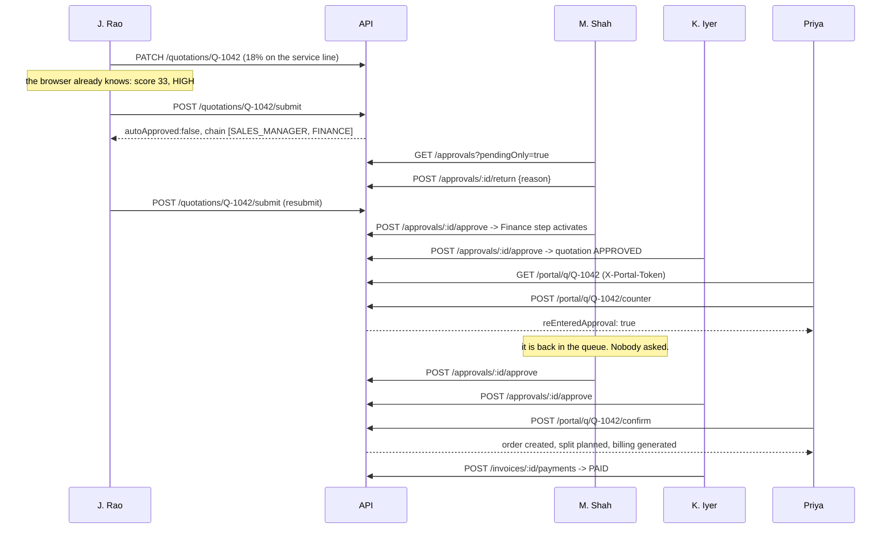

# API contract

Base path **`/api/v1`**. Frozen after Phase 3 — changes need an entry in
`CONTRACT_CHANGELOG.md`.

Live inventory of what is wired: `GET /api/v1/_routes`.
Per-module status, including what is still to build and who owns it:
`GET /api/v1/<module>/_health`.

## Conventions

**Every response** uses the same envelope:

```json
{ "success": true, "data": { }, "error": null, "meta": { } }
```

```json
{ "success": false, "data": null,
  "error": { "code": "VALIDATION_ERROR", "message": "…", "details": [] } }
```

- **Auth:** `Authorization: Bearer <jwt>` for everything internal.
- **Portal:** `X-Portal-Token: <token>` (or `?token=`) for `/portal/*`. The two
  are never sent together — the portal is a separate surface, not a header swap.
- **Ids** are strings on the wire, never raw ObjectIds.
- **Money** is an integer count of minor units (cents). `120000` is `$1,200.00`.
- **Dates** are ISO-8601 UTC strings.
- **Percentages** are numbers, not fractions: `12` means 12%.
- **Pagination:** `?page=1&pageSize=50`; `meta` carries `page`, `pageSize`,
  `total`, `totalPages`.
- **Search:** `?q=` where a list supports it.

### Error codes

| Code | HTTP | When |
|---|---|---|
| `VALIDATION_ERROR` | 400 | the body or query did not match the schema |
| `UNAUTHENTICATED` | 401 | missing, invalid or expired JWT |
| `FORBIDDEN` | 403 | authenticated, but not allowed |
| `NOT_FOUND` | 404 | no such record, or no such route |
| `CONFLICT` | 409 | a unique constraint was violated |
| `STALE_VERSION` | 409 | the quotation changed while you were editing it |
| `INSUFFICIENT_STOCK` | 409 | an allocation asked for more than is available |
| `INVALID_STATE` | 409 | the action is not legal from the current state |
| `PORTAL_TOKEN_INVALID` | 403 | unknown or revoked portal token |
| `PORTAL_TOKEN_EXPIRED` | 403 | the magic link has expired |
| `INTERNAL_ERROR` | 500 | anything unhandled |

**Status legend:** ✅ implemented · 🔨 owned by an agent, not built yet

---

## Health — Agent A

| M | Path | Auth | Status |
|---|---|---|---|
| GET | `/health` | none | ✅ |
| GET | `/_routes` | none | ✅ |
| GET | `/<module>/_health` | none | ✅ |

```json
{ "success": true, "data": { "status": "ok", "uptimeSeconds": 19,
  "mongo": "connected", "timestamp": "2026-09-05T08:05:37.904Z" }, "error": null }
```

---

## Auth — Agent A · screen 1

| M | Path | Auth | Request | Response | Status |
|---|---|---|---|---|---|
| POST | `/auth/login` | none | `LoginRequest` | `AuthSessionDto` | ✅ |
| POST | `/auth/signup` | none | `SignupRequest` | `AuthSessionDto` | ✅ |
| GET | `/auth/me` | any | — | `UserDto` | ✅ |
| GET | `/auth/demo-accounts` | none | — | `DemoAccountDto[]` | ✅ |

`POST /auth/login`

```json
{ "email": "rep@dealflow360.test", "password": "Demo@123" }
```

```json
{ "success": true, "error": null, "data": {
  "token": "eyJhbGciOiJIUzI1NiIsInR5cCI6IkpXVCJ9…",
  "expiresAt": "2026-09-05T20:05:37.000Z",
  "user": { "id": "a10002000000000000000000", "name": "J. Rao",
            "email": "rep@dealflow360.test", "role": "SALES_REP",
            "active": true, "landingRoute": "/app/dashboard" } } }
```

A customer login also carries `portalQuotationId`, so the portal can open their
live quotation straight away.

`GET /auth/demo-accounts` returns `[]` unless `SHOW_DEMO_LOGINS=true`.
Errors: `401 UNAUTHENTICATED` on a bad pair — identical message either way, so
nothing leaks about which half was wrong.

---

## Configuration — Agent A · screen 18

| M | Path | Auth | Request | Response | Status |
|---|---|---|---|---|---|
| GET | `/config` | any | — | `ApprovalChainConfigDto` | ✅ |
| PUT | `/config` | ADMIN, SALES_MANAGER | `UpdateApprovalConfigRequest` | `ConfigChangeImpactDto` | ✅ |
| GET | `/config/allowed-discount?tier=&category=` | any | — | `{tierCeiling, categoryCeiling, allowed}` | ✅ |

`PUT /config` — **this is the endpoint that proves nothing is hardcoded.**

```json
{ "tierCeilings":     { "GOLD": 20 },
  "categoryCeilings": { "SERVICES": 20 },
  "reason": "Q4 pricing policy — services discretion raised" }
```

```json
{ "success": true, "error": null, "data": {
  "config": { "…": "the saved configuration" },
  "reevaluated": [
    { "quotationId": "b11042000000000000000000", "quotationNumber": "Q-1042",
      "previousScore": 33, "previousLevel": "HIGH",
      "newScore": 0, "newLevel": "NONE", "autoApproved": true }
  ] }, "meta": { "reevaluatedCount": 4 } }
```

It re-prices and re-scores every open quotation, auto-approves any that no longer
need a human (closing their pending approval with an explanatory trail entry),
and writes one audit entry. `reason` is mandatory.

Errors: `400` if `reason` is missing · `404` if governance has never been saved.

---

## Catalogue and configuration data — Agent A

| M | Path | Auth | Response | Status |
|---|---|---|---|---|
| GET | `/products` | any | `ProductDto[]` | ✅ |
| GET | `/products/:id` | any | `ProductDto` | ✅ |
| GET | `/products/dashboard` | any | `ProductDashboardDto` | ✅ |
| POST | `/products` | ADMIN | `ProductDto` | ✅ |
| PUT | `/products/:id` | ADMIN | `ProductDto` | ✅ |
| GET | `/pricelists` · `/pricelists/:id` | any | `PriceListDto` | ✅ |
| PUT | `/pricelists/:id` | ADMIN | `PriceListDto` | ✅ |
| GET | `/warehouses` · `/warehouses/:id` | any | `WarehouseDto` | ✅ |
| POST · PUT | `/warehouses` · `/warehouses/:id` | ADMIN | `WarehouseDto` | ✅ |
| GET | `/subscription-plans` | any | `SubscriptionPlanDto[]` | ✅ |
| POST | `/subscription-plans` | ADMIN | `SubscriptionPlanDto` | ✅ |
| GET | `/customers` · `/customers/:id` | any | `CustomerDto` | ✅ |
| GET | `/users?role=` | ADMIN | `UserDto[]` | ✅ |

Filters: `/products?category=&status=&q=` · `/customers?tier=&ownerId=&q=`

---

## Quotations — Agent B · screens 2, 3, 4

| M | Path | Auth | Request | Response | Status |
|---|---|---|---|---|---|
| GET | `/quotations` | any | `QuotationListQuery` | `QuotationDto[]` | ✅ |
| GET | `/quotations/:id` | any | — | `QuotationDto` | ✅ |
| GET | `/quotations/board` | any | `?ownerId=` | `KanbanBoardDto` | ✅ |
| GET | `/quotations/dashboard` | any | — | `SalesDashboardDto` | ✅ |
| GET | `/quotations/:id/audit` | any | — | `AuditLogDto[]` | ✅ |
| POST | `/quotations` | REP, MGR, ADMIN | `CreateQuotationRequest` | `QuotationDto` | 🔨 B |
| PATCH | `/quotations/:id` | REP, MGR, ADMIN | `UpdateQuotationRequest` | `QuotationDto` | 🔨 B |
| POST | `/quotations/preview` | REP, MGR, ADMIN | `PreviewQuotationRequest` | `QuotationPreviewDto` | 🔨 B |
| POST | `/quotations/:id/submit` | REP, MGR, ADMIN | — | `SubmitQuotationResponse` | 🔨 B **[BLOCKING]** |

`PATCH /quotations/:id` — **must** send the `version` last read.

```json
{ "version": 3,
  "lines": [ { "id": "Q-1042-L1", "productId": "a30001…", "qty": 2, "discountPct": 12 },
             { "productId": "a30002…", "qty": 1, "discountPct": 18 } ] }
```

A line with no `id` is added; an omitted line is removed. A stale `version`
returns `409 STALE_VERSION`.

`POST /quotations/:id/submit` — the single most important write in the product.
It recomputes the blended risk server-side and **either** auto-approves **or**
opens the approval chain. The rep never chooses.

```json
{ "success": true, "error": null, "data": {
  "quotation": { "stage": "PENDING_APPROVAL", "…": "…" },
  "approval": { "id": "b21042…", "status": "PENDING",
                "currentStage": "SALES_MANAGER", "assignedToName": "M. Shah",
                "steps": [ { "role": "SALES_MANAGER", "status": "ACTIVE" },
                           { "role": "FINANCE", "status": "PENDING" } ] },
  "autoApproved": false,
  "risk": { "riskScore": 33, "riskLevel": "HIGH",
            "requiredChain": ["SALES_MANAGER", "FINANCE"],
            "blendedOverPct": 1.26, "maxSingleOver": 8,
            "explanation": [
              { "lineId": "Q-1042-L1", "line": "Laptop Pro 14", "category": "HARDWARE",
                "given": 12, "allowed": 15, "overBy": 0, "status": "OK", "weight": 0.84 },
              { "lineId": "Q-1042-L2", "line": "Onsite Setup Service", "category": "SERVICES",
                "given": 18, "allowed": 10, "overBy": 8, "status": "OVER", "weight": 0.16 } ],
            "summary": "1 of 2 lines exceed their own limit. Worst line is …" } } }
```

When risk is 0: `autoApproved: true`, `approval: null`, stage `APPROVED`.

---

## Pricing, risk and upsell — Agent B

| M | Path | Auth | Request | Response | Status |
|---|---|---|---|---|---|
| POST | `/pricing/preview` | any | `{customerId, lines[]}` | priced lines + totals | 🔨 B |
| POST | `/risk/preview` | any | `{customerId, lines[]}` | `RiskAssessmentDto` | 🔨 B |
| GET | `/upsell/suggestions?quotationId=` | any | — | `UpsellSuggestionDto[]` | 🔨 B |

```json
[ { "productId": "a30005…", "name": "Wireless Mouse", "sku": "WM-001",
    "category": "HARDWARE", "unitPrice": 3000, "marginDelta": 1800,
    "reason": "Bought alongside Laptop Pro 14 in 78% of past deals; adds 1800 minor units of margin.",
    "score": 0.69 } ]
```

> The preview endpoints exist so the server can *confirm* the client's optimistic
> numbers, not so the client can ask for them. The Angular builder computes
> totals, margin and risk locally from the same shared pure functions, and only
> reconciles on save.

---

## Approvals and audit — Agent C · screens 5, 6

| M | Path | Auth | Request | Response | Status |
|---|---|---|---|---|---|
| GET | `/approvals` | MGR, FIN, ADMIN, REP | `ApprovalListQuery` | `ApprovalListDto` | ✅ |
| GET | `/approvals/:id` | MGR, FIN, ADMIN, REP | — | `ApprovalDto` | ✅ |
| GET | `/approvals/:id/trail` | MGR, FIN, ADMIN, REP | — | `{trail, auditLog}` | ✅ |
| POST | `/approvals/:id/approve` | MGR, FIN | `{reason}` | `ApprovalDto` | 🔨 C |
| POST | `/approvals/:id/return` | MGR, FIN | `{reason}` | `ApprovalDto` | 🔨 C |
| POST | `/approvals/:id/reject` | MGR, FIN | `{reason}` | `ApprovalDto` | 🔨 C |
| GET | `/audit?entity=&entityId=&actorId=` | any | — | `AuditLogDto[]` | ✅ |

`GET /approvals?pendingOnly=true` · `?assignedToMe=true` filters to the caller's
own role queue — which is what Finance wants on login.

All three decision endpoints require a non-empty `reason` and write an
`AuditLog`. **Approve** advances to the next step, or completes the approval and
moves the quotation to `APPROVED`. **Return** sends it back to `DRAFT`.
**Reject** is terminal.

Errors: `403` if the caller's role is not the active step · `409 INVALID_STATE`
if the approval is already decided.

---

## Portal and negotiation — Agent C · screen 11

**A separate surface with a separate credential.** An internal JWT is refused.

| M | Path | Auth | Request | Response | Status |
|---|---|---|---|---|---|
| GET | `/portal/q/:number` | portal token or CUSTOMER | — | `PortalResolveResponse` | ✅ |
| GET | `/portal/q/:number/messages` | portal token or CUSTOMER | — | `NegotiationEventDto[]` | ✅ |
| POST | `/portal/q/:number/comment` | portal token or CUSTOMER | `PortalCommentRequest` | `NegotiationEventDto` | 🔨 C |
| POST | `/portal/q/:number/counter` | portal token or CUSTOMER | `PortalCounterRequest` | `PortalCounterResponse` | 🔨 C |
| POST | `/portal/q/:number/confirm` | portal token or CUSTOMER | — | `PortalConfirmResponse` | 🔨 C |

`POST /portal/q/Q-1042/counter` — **the re-approval loop.**

```json
{ "lines": [ { "lineId": "Q-1042-L2", "counterDiscountPct": 25,
               "comment": "Can you do better on the setup fee?" } ],
  "requestedDeliveryDate": "2026-10-01T00:00:00.000Z" }
```

```json
{ "success": true, "error": null, "data": {
  "quotation": { "stage": "PENDING_APPROVAL", "…": "…" },
  "risk": { "riskScore": 52, "riskLevel": "HIGH", "…": "…" },
  "reEnteredApproval": true,
  "approval": { "status": "PENDING", "reEnteredFromNegotiation": true,
                "currentStage": "SALES_MANAGER" },
  "message": "Your proposal goes beyond what your account manager can approve alone, so it has gone back for internal approval automatically." } }
```

The server applies the counter, recomputes the blended risk, and — if it now
breaches the thresholds — forces `PENDING_APPROVAL` with the audit reason
`RE_ENTERED_FROM_NEGOTIATION`. If it does not breach, `reEnteredApproval` is
`false` and the quote stays in `NEGOTIATION`.

`POST /…/confirm` moves the quotation to `CONFIRMED`, creates the order, and runs
the split. If the terms breach on confirm, it re-enters approval instead and
returns `reEnteredApproval: true` with a null order.

**Security, tested in `npm run smoke` step 7:**

| Caller | Result |
|---|---|
| Priya's magic link on Q-1042 | `200` |
| R. Das (Beta Industries), signed in | `403 FORBIDDEN` — "belongs to a different company" |
| An internal `SALES_REP` JWT | `403 PORTAL_TOKEN_INVALID` |
| The seeded expired token | `403 PORTAL_TOKEN_EXPIRED` |

---

## Fulfillment and stock — Agent D · screens 7, 8

| M | Path | Auth | Request | Response | Status |
|---|---|---|---|---|---|
| GET | `/fulfillment` | internal | — | `FulfillmentListDto` | ✅ |
| GET | `/fulfillment/:id` | internal | — | `FulfillmentDto` | ✅ |
| POST | `/fulfillment/plan/:orderId` | internal | — | `FulfillmentDto` | 🔨 D |
| POST | `/fulfillment/:id/accept` | internal | — | `AcceptSplitResponse` | 🔨 D |
| POST | `/fulfillment/:id/override` | MGR, FIN, ADMIN | `ManualSplitOverrideRequest` | `FulfillmentDto` | 🔨 D |
| POST | `/fulfillment/:id/ship` | internal | `{warehouseId}` | `FulfillmentDto` | 🔨 D |
| GET | `/fulfillment/:id/consolidation` | internal | — | `{available, coveredBy[]}` | 🔨 D |
| GET | `/stock` | internal | `?warehouseId=&productId=` | `StockDto[]` | ✅ |
| POST | `/stock/adjust` | ADMIN, FIN | `AdjustStockRequest` | `StockDto` | 🔨 D |
| GET | `/orders` · `/orders/:id` | internal | — | `OrderDto` | ✅ |
| POST | `/orders/from-quotation/:id` | internal | — | `OrderDto` | 🔨 D |

`FulfillmentDto` always carries a non-empty `rationale`:

```json
{ "orderNumber": "ORD-1032", "status": "SPLIT_PENDING",
  "allocations": [
    { "warehouseName": "Main Warehouse", "qty": 18, "estShipments": 1, "estCost": 4200,
      "lines": [ { "lineId": "…", "productName": "Laptop Pro 14", "qty": 18 } ] },
    { "warehouseName": "East Depot", "qty": 6, "estShipments": 1, "estCost": 2600,
      "lines": [ { "lineId": "…", "productName": "Laptop Pro 14", "qty": 6 } ] } ],
  "backorders": [], "totalShipments": 2, "totalCost": 6800,
  "rationale": [
    "No single warehouse can cover the whole order (24 units across 1 line), so the order is being split.",
    "Warehouses ranked by (lines fully coverable DESC, shipping cost weight ASC): Main Warehouse [weight 1] > East Depot [weight 1.4].",
    "Main Warehouse covers a partial remainder of 18 unit(s): Laptop Pro 14 x18.",
    "East Depot covers a partial remainder of 6 unit(s): Laptop Pro 14 x6.",
    "Final plan: 2 warehouse(s), 2 shipment(s), estimated cost 6800 minor units, 0 unit(s) on backorder." ] }
```

`POST /fulfillment/:id/override` requires a `reason`, validates against live
availability (`409 INSUFFICIENT_STOCK` if it does not fit), reserves, and
audit-logs the override.

`POST /stock/adjust` is how a restock happens — and it must flip a covered
backorder to `CONSOLIDATION_AVAILABLE`, which is what raises screen 8's banner.

---

## Billing — Agent D · screens 9, 10, 12, 13

| M | Path | Auth | Request | Response | Status |
|---|---|---|---|---|---|
| GET | `/subscriptions` | internal | `?status=&customerId=` | `SubscriptionListDto` | ✅ |
| GET | `/subscriptions/:id` | internal | — | `SubscriptionDto` | ✅ |
| POST | `/subscriptions/:id/modify` | MGR, FIN | `ModifySubscriptionRequest` | `ModifySubscriptionResponse` | 🔨 D |
| POST | `/subscriptions/:id/cancel` | MGR, FIN | `CancelSubscriptionRequest` | `CancelSubscriptionResponse` | 🔨 D |
| GET | `/billing/subscription/:id` | internal | — | `BillingDetailDto` | ✅ |
| POST | `/billing/run-schedule` | FIN, ADMIN | — | `InvoiceDto[]` | 🔨 D |
| GET | `/invoices` | internal | `?status=&customerId=` | `InvoiceListDto` | ✅ |
| GET | `/invoices/:id` | internal | — | `{invoice, order, relatedInvoices}` | ✅ |
| POST | `/invoices/generate/:orderId` | FIN, ADMIN | — | `InvoiceDto` | 🔨 D |
| POST | `/invoices/:id/payments` | MGR, FIN, ADMIN | `RecordPaymentRequest` | `InvoiceDto` | 🔨 D |
| GET | `/invoices/:id/summary.csv` | internal | — | `text/csv` | 🔨 D |

`POST /subscriptions/:id/modify`

```json
{ "qty": 2, "reason": "Customer doubled the seat count" }
```

```json
{ "success": true, "error": null, "data": {
  "subscription": { "qty": 2, "amount": 8694, "…": "…" },
  "proration": { "credit": 2174, "charge": 4348, "net": 2174,
    "explanation": "15 of 30 days remain in the cycle (50.0%). Credit 2174 for the unused old plan, charge 4348 for the new plan, net 2174." },
  "creditNote": null } }
```

A negative `net` produces a `CreditNoteDto` instead of a next-invoice line.

`POST /invoices/generate/:orderId` bills **only** `min(qtyShipped, qty) −
qtyInvoiced` on the non-subscription lines. Recurring lines are never on it.

---

## Deal health and reporting — Agent D · screens 14, 15

| M | Path | Auth | Request | Response | Status |
|---|---|---|---|---|---|
| GET | `/deal-health` | internal | `?type=&status=` | `DealHealthDashboardDto` | ✅ |
| POST | `/deal-health/evaluate` | MGR, ADMIN | — | `DealAlertDto[]` | 🔨 D |
| POST | `/deal-health/:id/nudge` | MGR, ADMIN, REP | `{note?}` | `AlertActionResponse` | 🔨 D |
| POST | `/deal-health/:id/escalate` | MGR, ADMIN | `{note?}` | `AlertActionResponse` | 🔨 D |
| GET | `/reporting` | ADMIN, MGR, FIN | `ReportingQuery` | `ReportingDashboardDto` | ✅ |
| GET | `/reporting/export.csv` | ADMIN, MGR, FIN | `ReportingQuery` | `text/csv` | 🔨 D |
| GET | `/notifications` | any | `?read=` | `NotificationDto[]` | ✅ |
| PATCH | `/notifications/:id/read` | any | — | `NotificationDto` | 🔨 C |

`GET /reporting?period=month&repId=&approvalStatus=&category=` — the PDF's four
filters. Every figure is aggregated from live documents:

```json
{ "quotesCreated": 147, "avgApprovalTimeMs": 28080000,
  "avgApprovalTimeLabel": "7.8 hours",
  "topUpsellProduct": { "productId": "a30006…", "name": "Care Plan 2yr", "timesAdded": 46 },
  "totalQuotedValue": 128450012, "conversionRatePct": 22.4,
  "byStage": [ … ], "byRep": [ … ], "byProduct": [ … ] }
```

---

## Sequence: the golden path


