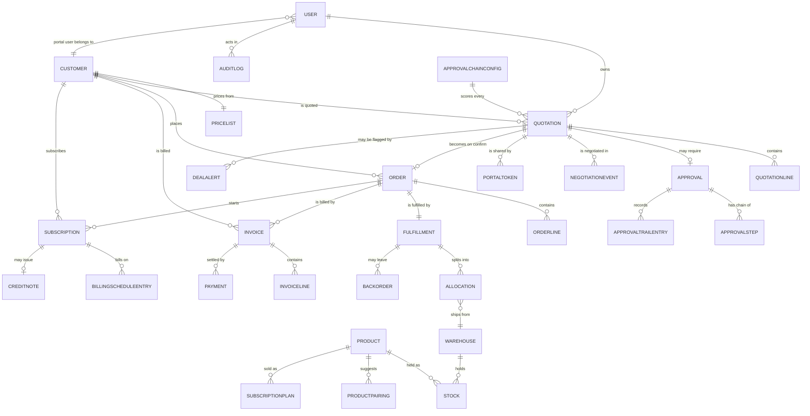

# Data model

MongoDB via Mongoose. Schemas live in `apps/api/src/db/models.ts`; the wire
shapes they serialise into live in `packages/shared/src/types/entities.ts`.

## Conventions

- `_id` is a real ObjectId; it serialises to a string `id`.
- **Money is an integer count of minor units (cents).** Never a Double.
- Dates are stored as `Date` and serialise to ISO-8601 UTC.
- Every model declares its indexes here, and `syncAllIndexes()` builds them
  explicitly during reset — no query ever silently falls back to a scan.
- Seeded documents have **fixed** ObjectIds (`fid('a1', 2)` →
  `a10002000000000000000000`), so a reset is byte-reproducible.

## Entity relationships



`APPROVALCHAINCONFIG` is a singleton (`key: 'default'`). It is drawn touching
every quotation because it genuinely does: changing it re-scores them all.

---

## Identity

### `User`

| Field | Type | Notes |
|---|---|---|
| `name` | string | required |
| `email` | string | required, lowercased, **unique** |
| `passwordHash` | string | bcrypt. Plaintext is never stored. |
| `role` | enum | ADMIN · SALES_REP · SALES_MANAGER · FINANCE · CUSTOMER |
| `customerId` | ObjectId → Customer | **only** for CUSTOMER — the scope of their portal access |
| `active` | boolean | inactive users cannot sign in |
| `trailingAvgDiscountPct` | number | the baseline the discount-anomaly rule compares against |

Indexes: `{email} unique` · `{role, active}`

### `Customer`

| Field | Type | Notes |
|---|---|---|
| `name` | string | **unique** |
| `tier` | enum | BRONZE · SILVER · GOLD — drives the tier discount ceiling |
| `currency` | enum | USD · EUR |
| `priceListId` | ObjectId → PriceList | what they pay |
| `contactName` · `contactEmail` | string | |
| `ownerId` | ObjectId → User | the owning rep |

Indexes: `{name} unique` · `{ownerId, tier}`

> A customer's **tier** (screen 18, discount ceilings) and their **price list**
> (screen 17, what they pay) are separate concerns and are modelled separately.

---

## Catalogue

### `Product`

| Field | Type | Notes |
|---|---|---|
| `sku` | string | **unique** |
| `name` · `description` | string | |
| `category` | enum | HARDWARE · SERVICES · SUBSCRIPTION — drives the category ceiling |
| `unitPrice` | Money | base list price, before any price-list rule |
| `costPrice` | Money | drives margin and upsell ranking |
| `unit` | string | "Each", "Recurring" |
| `taxPct` | number | |
| `isSubscription` | boolean | true → this line generates a Subscription, not an invoice line |
| `recurringCycle` | enum | only when `isSubscription` |
| `quantityOnHand` | number | catalogue-level; the authoritative figure is per-warehouse `Stock` |
| `status` | enum | ACTIVE · ARCHIVED |
| `promoted` · `promoTag` | boolean · string | ranks higher in the upsell panel |
| `variants` | `[{attribute, values: [{value, extraPrice}]}]` | screen 17's grid |

Indexes: `{sku} unique` · `{category, status}` · text on `{name, description}`

### `PriceList`

| Field | Type | Notes |
|---|---|---|
| `tier` | enum | **unique** — one list per tier |
| `currencies` | enum[] | Gold carries USD and EUR |
| `ruleType` | enum | NONE · PERCENT_OFF_BASE · FIXED_PRICE |
| `ruleValue` | number | percent for PERCENT_OFF_BASE (`10` = "base minus 10 percent") |
| `entries` | `[{productId, price}]` | per-product overrides, which beat the rule |

### `ProductPairing`

`{productId, suggestedProductId, coPurchaseFrequency}` — the historical
co-purchase data the upsell ranking reads. Index `{productId, suggestedProductId} unique`.

---

## Inventory

### `Warehouse`

| Field | Type | Notes |
|---|---|---|
| `code` | string | **unique** |
| `name` | string | |
| `shippingCostWeight` | number | **ranking only.** Lower is preferred. |
| `baseShipmentCost` | Money | **estimation only.** Fixed cost per shipment. |
| `perUnitShippingCost` | Money | **estimation only.** Marginal cost per unit. |
| `replenishmentRule` | `{leadTimeDays, reorderPoint, reorderQty}` | lead time drives the backorder ETA |

> Ranking and cost estimation are separate numbers on purpose — see
> `DECISIONS.md` D-019.

### `Stock`

| Field | Type | Notes |
|---|---|---|
| `warehouseId` · `productId` | ObjectId | **unique together** |
| `inStock` | number | physically present |
| `reserved` | number | committed to confirmed orders |
| `available` | number | **always** `inStock − reserved`, enforced by a pre-validate hook |
| `incomingEta` | Date | inbound replenishment; beats the lead-time estimate for a backorder ETA |

Indexes: `{warehouseId, productId} unique` · `{productId, available: -1}`

> **Invariant:** `available === max(0, inStock − reserved)` for every row.
> A reset assertion fails if it is ever untrue.

---

## Governance

### `ApprovalChainConfig` — singleton, `key: 'default'`

| Field | Type | Seeded |
|---|---|---|
| `tierCeilings` | `Map<CustomerTier, number>` | Bronze 5, Silver 10, Gold 15 |
| `categoryCeilings` | `Map<ProductCategory, number>` | Hardware 15, Services 10, Subscription 5 |
| `thresholds.mediumMinScore` | number | 1 |
| `thresholds.highMinScore` | number | 30 |
| `thresholds.hardEscalationMaxSingleOver` | number | 8 |
| `thresholds.blendedWeight` | number | 7 |
| `thresholds.maxSingleWeight` | number | 3 |
| `chains` | `Map<RiskLevel, Role[]>` | NONE `[]` · MEDIUM `[SALES_MANAGER]` · HIGH `[SALES_MANAGER, FINANCE]` |
| `dealHealth` | `{stalledDays, anomalyMultiplier, anomalyAbsoluteCapPct, trailingWindow}` | 7 · 2.0 · 25 · 20 |
| `upsell` | `{coPurchaseWeight, promotedWeight, marginWeight, minMarginThreshold, maxSuggestions}` | 0.5 · 0.2 · 0.3 · $5 · 3 |
| `billing` | `{defaultProrationRule, cancellationRule, scheduleHorizon, invoiceDueDays}` | PRORATED · PRORATED · 12 · 15 |

**This document is the reason nothing is hardcoded.** Every risk score, every
routing decision, every deal-health alert and every upsell ranking reads from it.

### `SubscriptionPlan`

`{name (unique), productId, cycle, amount, prorationRule, cancellationRule, active}`

---

## Quotation

### `Quotation`

| Field | Type | Notes |
|---|---|---|
| `number` | string | **unique**, `Q-1042` |
| `customerId` · `customerName` · `tier` | | denormalised for list screens |
| `priceListId` · `currency` | | |
| `ownerId` · `ownerName` | | the rep |
| `stage` | enum | DRAFT · PENDING_APPROVAL · APPROVED · NEGOTIATION · CONFIRMED · REJECTED |
| `lines` | `QuotationLine[]` | embedded, below |
| `totals` | embedded | subtotal, discountTotal, netTotal, taxTotal, grandTotal, costTotal, marginTotal, marginPct, **oneTimeTotal**, **recurringTotal** |
| `risk` | embedded | the full `RiskAssessment`, including the explanation array |
| `approvalId` · `orderId` | ObjectId | |
| `validUntil` · `promisedDeliveryDate` | Date | |
| `lastActivityAt` | Date | **any** human touch. Drives the stalled-deal rule. |
| `submittedAt` | Date | |
| `version` | number | optimistic-concurrency guard, bumped on every write |

Indexes: `{number} unique` · `{stage, lastActivityAt: -1}` · `{ownerId, stage}` ·
`{customerId, createdAt: -1}` · `{'risk.riskLevel'}`

### `QuotationLine` (embedded)

Inputs: `lineId, productId, productName, sku, category, qty, unitPrice,
costPrice, discountPct, taxPct, isSubscription, recurringCycle,
selectedVariants, addedFromUpsell`.

Computed and persisted (so list screens never recompute): `allowedDiscountPct,
lineGross, lineDiscount, lineNet, lineTax, lineTotal, lineCost, lineMargin,
marginPct, discountStatus (OK|OVER), overByPts`.

> `allowedDiscountPct` is `min(tierCeiling, categoryCeiling)` — computed, never
> user-entered. It is what screen 4's **Limit** column shows.

### `risk` (embedded)

```
riskScore, riskLevel, blendedOverPct, maxSingleOver, requiredChain[],
explanation[{lineId, line, category, given, allowed, overBy, status, weight}],
summary, ceilingsUsed{tier, tierCeiling, categoryCeilings}
```

`ceilingsUsed` is snapshotted so an old assessment stays explainable after the
configuration changes.

---

## Approvals and audit

### `Approval`

| Field | Type | Notes |
|---|---|---|
| `quotationId` · `quotationNumber` | | |
| `customerId` · `customerName` · `tier` · `ownerId` · `ownerName` · `amount` | | denormalised for the queue |
| `status` | enum | NOT_REQUIRED · PENDING · APPROVED · RETURNED · REJECTED |
| `risk` | embedded | snapshot **at submit time**, re-snapshotted on resubmit |
| `steps` | `[{role, status, actorId, actorName, action, reason, actedAt, activatedAt}]` | the chain |
| `currentStepIndex` | number | index of the ACTIVE step, or −1 |
| `currentStage` · `assignedToName` | | the queue's Stage and Assigned To columns |
| `trail` | `[{actorId, actorName, role, action, reason, at}]` | screen 6's audit table |
| `submittedAt` · `decidedAt` · `cycleTimeMs` | | `cycleTimeMs` feeds Avg Approval Time |
| `reEnteredFromNegotiation` | boolean | true → screen 6 shows the "Back from the customer" panel |

Indexes: `{quotationId, createdAt: -1}` · `{status, currentStage}` · `{submittedAt: -1}`

### `AuditLog`

`{actor, actorId, role, action, entity, entityId, entityLabel, before, after,
reason, timestamp}`

Indexes: `{entity, entityId, timestamp: -1}` · `{timestamp: -1}` ·
`{actorId, timestamp: -1}`

> **Non-negotiable:** every approval, rejection, edit, discount change, override
> and negotiation event writes one of these. A reset assertion fails if any entry
> lacks an actor.

---

## Portal and negotiation

### `PortalToken`

`{token (unique), quotationId, customerId, userId, expiresAt, revoked, lastUsedAt}`

A token unlocks **exactly one** quotation for **exactly one** customer. That
scope is checked server-side on every request, so guessing a URL fails the same
way as reusing someone else's link.

### `NegotiationEvent`

`{quotationId, lineId, lineName, type, authorId, authorName, fromCustomer,
comment, counterDiscountPct, requestedDeliveryDate, requestedQty}`

Types: COMMENT · COUNTER_DISCOUNT · DELIVERY_DATE_REQUEST · QTY_CHANGE_REQUEST ·
REP_REPLY · CONFIRMED. Index `{quotationId, createdAt: 1}`.

---

## Order and fulfillment

### `Order`

`{number (unique, ORD-1041), quotationId, quotationNumber, customerId, ownerId,
status, lines[], totals, confirmedAt, promisedDeliveryDate,
projectedDeliveryDate, fulfillmentId}`

Status: CONFIRMED · SHIPPED · INVOICED · PAID · CANCELLED — screen 13's stepper.

**`OrderLine`** adds three counters to the quotation line: `qty`, **`qtyShipped`**
and **`qtyInvoiced`**. Those three fields are the entire "nothing is billed
before it ships" mechanism.

> An Order is deliberately distinct from a Quotation. Collapsing them would make
> "what was quoted" unrecoverable after confirmation — see `DECISIONS.md` D-017.

### `Fulfillment`

| Field | Type | Notes |
|---|---|---|
| `orderId` | ObjectId | **unique** — one fulfillment per order |
| `status` | enum | PENDING · SPLIT_PENDING · RESERVED · PARTIALLY_SHIPPED · SHIPPED · BACKORDER · CONSOLIDATION_AVAILABLE · CANCELLED |
| `allocations` | `[{warehouseId, warehouseName, lines[], qty, estShipments, estCost, shipped, shippedAt}]` | |
| `backorders` | `[{lineId, productId, productName, qty, warehouseId, warehouseName, etaDate}]` | |
| `totalShipments` · `totalCost` | | |
| `rationale` | string[] | **never empty.** Plain English, shown on screen 8. |
| `overridden` · `overriddenBy` · `overrideReason` | | set by a manual override |
| `consolidationAvailableAt` | Date | set when a restock covers the backorder → raises the banner |

---

## Billing

### `Subscription`

`{number (unique), customerId, orderId, planId, planName, productId, cycle, qty,
unitAmount, amount, currency, status, startDate, nextBillDate, cancelledAt,
endDate, prorationRule, cancellationRule, schedule[]}`

`BillingScheduleEntry`: `{seq, dueDate, periodStart, periodEnd, amount, invoiced,
invoiceId}` — and `dueDate === periodStart`, because a recurring line is invoiced
at the **beginning** of the period.

Indexes: `{number} unique` · `{customerId, status}` · `{status, nextBillDate}`

### `Invoice`

| Field | Type | Notes |
|---|---|---|
| `number` | string | **unique**, `INV-1042` |
| `type` | enum | **ONE_TIME · RECURRING** — one order produces both, and they never share a line |
| `customerId` · `orderId` · `subscriptionId` | | |
| `status` | enum | DRAFT · ISSUED · PARTIALLY_PAID · PAID · OVERDUE · VOID |
| `lines` | `[{lineId, productId, description, qty, unitPrice, discountPct, net, tax, total}]` | |
| `subtotal` · `taxTotal` · `total` · `amountPaid` · `amountDue` | Money | |
| `issueDate` · `dueDate` · `periodStart` · `periodEnd` | Date | the period fields are for RECURRING only |
| `payments` | `[{amount, method, reference, receivedAt, recordedById, recordedByName}]` | |

> **Invariants**, both asserted by `npm run reset`:
> `total === Σ lines.total` and `amountDue === total − amountPaid`.

### `CreditNote`

`{number (unique), customerId, subscriptionId, invoiceId, amount, reason,
issuedAt}` — issued by a downgrade or a PRORATED cancellation.

---

## Deal health

### `DealAlert`

`{type, severity, status, quotationId, quotationNumber, orderId, customerId,
ownerId, ownerName, entityLabel, issue, detail, flaggedAt, actions[]}`

- `type`: STALLED_DEAL · DISCOUNT_ANOMALY · DELIVERY_SLIPPAGE
- `status`: OPEN · NUDGED · ESCALATED · RESOLVED
- `entityLabel` is screen 14's **Deal** column (`Q-1030`, or `Delta LLC`)
- `issue` is its **Issue** column (`idle 9 days`, `discount 32% vs avg 8%`)
- `actions`: `[{action: NUDGE|ESCALATE, actorId, actorName, at, note}]`

Indexes: `{type, status, flaggedAt: -1}` · `{quotationId, type} unique sparse` —
one alert per deal per rule, so re-evaluation updates rather than duplicates.

---

## Supporting

| Model | Purpose |
|---|---|
| `Notification` | `{userId, type, title, body, link, read}` — nudges and escalations |
| `Counter` | `{_id, seq}` — monotonic document-number sequences |

---

## Seeded volume

After `npm run reset`:

| Collection | Docs | | Collection | Docs |
|---|---|---|---|---|
| User | 7 | | Quotation | 149 |
| Customer | 6 | | Approval | 17 |
| Product | 10 | | Order | 3 |
| PriceList | 3 | | Fulfillment | 3 |
| Warehouse | 2 | | Subscription | 21 (16 active / 2 paused / 3 cancelled) |
| Stock | 8 | | Invoice | 3 |
| SubscriptionPlan | 4 | | DealAlert | 8 (5 stalled / 2 anomalies / 1 slippage) |
| ProductPairing | 7 | | AuditLog | 10 |
| ApprovalChainConfig | 1 | | PortalToken | 2 (one live, one expired) |

Enough that all 18 screens are non-empty on first run, and small enough that a
full reset finishes in seconds.
