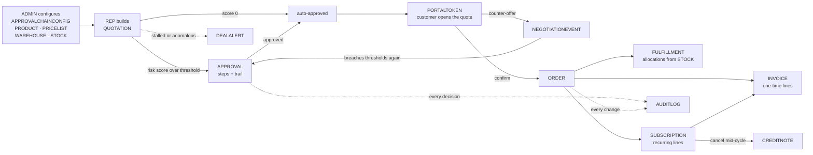

# Database diagram

Every MongoDB collection, what it holds, and how they connect. Generated from
`apps/api/src/db/models.ts` — if the two disagree, the code is right.

`DATA_MODEL.md` is the field-by-field reference; this is the map.

---

## The whole model

Relationship notation: `||--o{` means one-to-many, `||--o|` one-to-optional-one.
Embedded arrays (lines, steps, allocations, schedule entries, payments) live
**inside** their parent document and are shown as fields, not as boxes.

```mermaid
erDiagram
    USER ||--o{ CUSTOMER : "owns as rep"
    USER ||--o| CUSTOMER : "portal login belongs to"
    USER ||--o{ QUOTATION : raises
    USER ||--o{ AUDITLOG : acts
    USER ||--o{ NOTIFICATION : receives

    CUSTOMER ||--|| PRICELIST : "prices through tier"
    CUSTOMER ||--o{ QUOTATION : receives
    CUSTOMER ||--o{ ORDER : places
    CUSTOMER ||--o{ INVOICE : "is billed"
    CUSTOMER ||--o{ SUBSCRIPTION : holds

    PRODUCT ||--o{ STOCK : "held as"
    PRODUCT ||--o{ PRODUCTPAIRING : "suggests via"
    PRODUCT ||--o{ SUBSCRIPTIONPLAN : "billed by"
    PRICELIST ||--o{ PRODUCT : "overrides price of"
    WAREHOUSE ||--o{ STOCK : stores

    QUOTATION ||--o| APPROVAL : "routes to"
    QUOTATION ||--o| ORDER : "becomes on confirm"
    QUOTATION ||--o{ PORTALTOKEN : "shared by"
    QUOTATION ||--o{ NEGOTIATIONEVENT : "discussed in"
    QUOTATION ||--o{ DEALALERT : "flagged by"

    ORDER ||--o| FULFILLMENT : "shipped via"
    ORDER ||--o{ INVOICE : "billed as"
    ORDER ||--o{ SUBSCRIPTION : "generates recurring"
    FULFILLMENT }o--o{ WAREHOUSE : "allocates from"

    SUBSCRIPTION ||--o{ INVOICE : "bills each cycle"
    SUBSCRIPTION ||--o{ CREDITNOTE : "refunds via"
    INVOICE ||--o{ CREDITNOTE : "credited by"

    APPROVALCHAINCONFIG ||--o{ QUOTATION : "scores and routes"
    COUNTER ||--o{ QUOTATION : "numbers"

    USER {
        string name
        string email
        string passwordHash
        enum role "ADMIN SALES_REP SALES_MANAGER FINANCE CUSTOMER"
        ObjectId customerId "CUSTOMER role only"
        bool active
        bool mustChangePassword
        number trailingAvgDiscountPct "feeds the anomaly rule"
    }

    CUSTOMER {
        string name
        enum tier "BRONZE SILVER GOLD"
        enum currency
        ObjectId priceListId
        string contactName
        string contactEmail
        ObjectId ownerId "owning rep"
        bool active
    }

    PRODUCT {
        string sku
        string name
        enum category "HARDWARE SERVICES SUBSCRIPTION"
        Money unitPrice
        Money costPrice
        number taxPct
        bool isSubscription
        enum recurringCycle
        number quantityOnHand "sum of STOCK for hardware"
        enum status "ACTIVE ARCHIVED"
        bool promoted
        array variants "attribute + values + extraPrice"
    }

    PRICELIST {
        string name
        enum tier
        array currencies
        enum ruleType "NONE PERCENT_OFF_BASE FIXED_PRICE"
        number ruleValue
        array entries "per-product overrides"
        bool active
    }

    PRODUCTPAIRING {
        ObjectId productId
        ObjectId suggestedProductId
        number coPurchaseFrequency "ranks the upsell panel"
    }

    WAREHOUSE {
        string code
        string name
        number shippingCostWeight "lower wins the split"
        Money baseShipmentCost
        Money perUnitShippingCost
        object replenishmentRule "leadTime reorderPoint reorderQty"
        bool active
    }

    STOCK {
        ObjectId warehouseId
        ObjectId productId
        number inStock
        number reserved
        number available "always inStock - reserved"
        date incomingEta
    }

    APPROVALCHAINCONFIG {
        map tierCeilings "per customer tier"
        map categoryCeilings "per product category"
        object thresholds "medium high hardEscalation weights"
        map chains "risk level to approver roles"
        object dealHealth
        object upsell
        object billing
        string updatedBy
    }

    SUBSCRIPTIONPLAN {
        string name
        ObjectId productId
        enum cycle
        Money amount
        enum prorationRule
        enum cancellationRule
        bool active
    }

    QUOTATION {
        string number "from COUNTER"
        ObjectId customerId
        ObjectId ownerId
        ObjectId priceListId
        enum stage "DRAFT PENDING_APPROVAL APPROVED NEGOTIATION CONFIRMED REJECTED"
        array lines "embedded: product qty discount tax margin"
        object totals "subtotal tax grandTotal costTotal"
        object risk "snapshot: score level explanation"
        ObjectId approvalId
        ObjectId orderId
        date promisedDeliveryDate
        date lastActivityAt "drives the stalled rule"
        number version "optimistic locking"
    }

    APPROVAL {
        ObjectId quotationId
        string quotationNumber "snapshot"
        string customerName "snapshot"
        Money amount "snapshot"
        enum status "PENDING APPROVED RETURNED REJECTED NOT_REQUIRED"
        object risk "snapshot at submit time"
        array steps "embedded: role status actor reason actedAt"
        number currentStepIndex
        enum currentStage "role holding the ball"
        array trail "embedded decision log"
        number cycleTimeMs "feeds the SLA KPI"
        bool reEnteredFromNegotiation
    }

    AUDITLOG {
        string actor
        ObjectId actorId
        enum role
        string action
        enum entity
        ObjectId entityId
        string entityLabel
        object before
        object after
        string reason "always required"
        date timestamp
    }

    PORTALTOKEN {
        string token "magic link"
        ObjectId quotationId "unlocks exactly one"
        ObjectId customerId
        ObjectId userId
        date expiresAt
        bool revoked
        date lastUsedAt
    }

    NEGOTIATIONEVENT {
        ObjectId quotationId
        enum eventType "COMMENT CHANGE_REQUEST COUNTER_OFFER CONFIRMATION"
        string lineId
        string lineName
        ObjectId authorId
        string authorName
        string message
        number counterDiscountPct
        date at
    }

    NOTIFICATION {
        ObjectId userId
        enum type
        string title
        string body
        string link
        bool read
    }

    ORDER {
        string number
        ObjectId quotationId
        ObjectId customerId
        ObjectId ownerId
        enum status
        array lines "embedded: qty qtyShipped qtyInvoiced"
        object totals
        ObjectId fulfillmentId
    }

    FULFILLMENT {
        ObjectId orderId
        string orderNumber "snapshot"
        enum status "PLANNED PARTIAL BACKORDER SHIPPED CANCELLED"
        array allocations "embedded: warehouse lines qty shippedAt"
        array backorders "embedded: product qty eta"
        number shipmentCount
        Money estimatedCost
        array rationale "why the planner split this way"
        date consolidationAvailableAt
    }

    SUBSCRIPTION {
        string number
        ObjectId customerId
        ObjectId orderId
        ObjectId planId
        ObjectId productId
        enum cycle
        number qty
        Money unitAmount
        Money amount
        enum status "ACTIVE PAUSED CANCELLED"
        date nextBillDate
        array schedule "embedded: period amount invoiceId"
        enum prorationRule
        enum cancellationRule
    }

    INVOICE {
        string number
        ObjectId customerId
        ObjectId orderId
        ObjectId subscriptionId "recurring invoices only"
        enum type "ONE_TIME RECURRING"
        enum status "DRAFT SENT PARTIAL PAID OVERDUE"
        array lines
        Money total
        Money amountPaid
        Money amountDue
        date dueDate
        array payments "embedded: method amount recordedBy"
    }

    CREDITNOTE {
        string number
        ObjectId customerId
        ObjectId subscriptionId
        ObjectId invoiceId
        Money amount
        string reason
        date issuedAt
    }

    DEALALERT {
        enum type "STALLED DISCOUNT_ANOMALY DELIVERY_SLIPPAGE"
        enum severity "MEDIUM HIGH"
        enum status "OPEN NUDGED ESCALATED RESOLVED"
        ObjectId quotationId
        ObjectId ownerId
        string issue
        string detail
        array actions "nudge escalate history"
        date flaggedAt
    }

    COUNTER {
        string _id "sequence name"
        number seq
    }
```

---

## How data flows through it

The same picture as a lifecycle, which is how the demo runs:

---

## Reading the model

Three things about this schema are deliberate and worth knowing before you
change anything:

**Snapshots are not duplicates.** `APPROVAL` stores `customerName`, `amount` and
its own copy of `risk` because they must show what the approver actually saw. If
a customer is renamed, or the discount ceilings are edited on screen 18, a
decision already taken must not silently change. Same reason `FULFILLMENT`
allocations carry `warehouseName`.

**`available` is derived and enforced.** `STOCK.available` is always
`inStock - reserved`, recomputed by a `pre('validate')` hook, and
`npm run reset:check` asserts it across every row.

**Embedded vs referenced.** A thing that only ever belongs to one parent and is
always read with it is embedded — quotation lines, approval steps, fulfillment
allocations, invoice payments, subscription schedule entries. A thing queried on
its own gets a collection. That is why `payments` has no collection: you never
ask for a payment except through its invoice.
