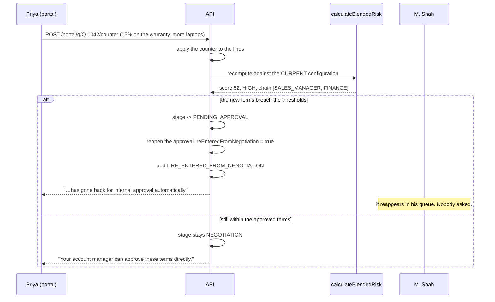
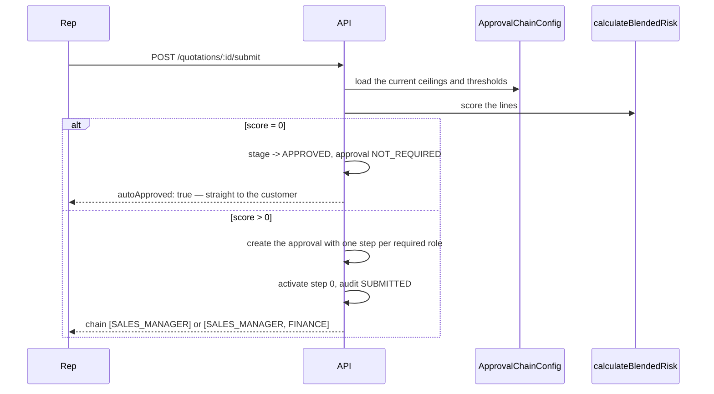
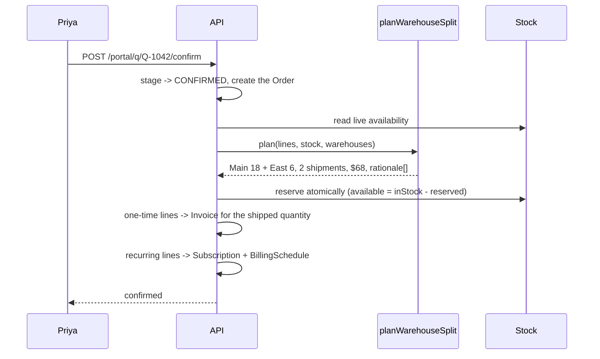
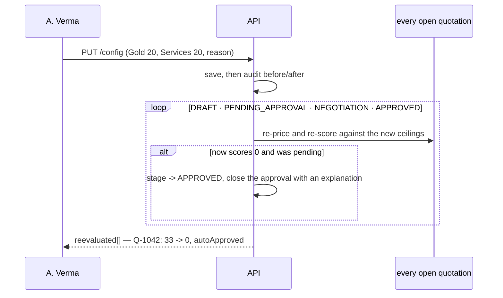
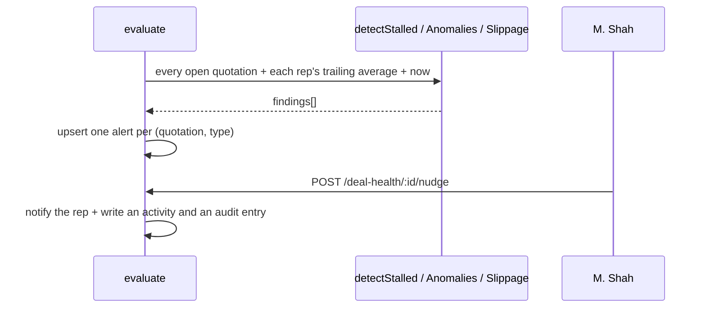
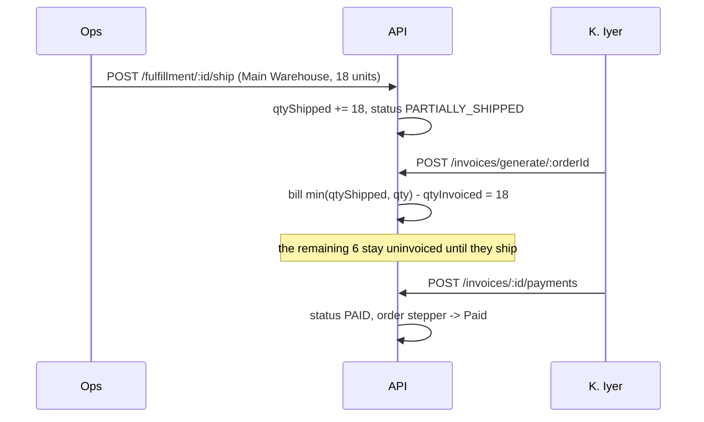

# DealFlow360 — master specification

**An intelligent, self-governing B2B sales operations platform.**
Quotation → blended-risk approval → customer negotiation → multi-warehouse
fulfillment → hybrid billing → analytics.

This is the shared brain. Read it first. Then read `USER_FLOWS.md`, then your own
`ARCHITECTURE.md`.

| Document | What it is for |
|---|---|
| **`MASTER_SPEC.md`** | this file — the whole system in one place |
| `USER_FLOWS.md` | the same system from the user's side: personas, the golden path, unhappy paths |
| `BUSINESS_RULES.md` | every rule, with worked numbers and its test |
| `DATA_MODEL.md` | schemas, indexes, the ER diagram |
| `API_CONTRACT.md` | every endpoint, with example JSON |
| `UI_SPEC.md` | every screen: component tree, stores, states, exact copy |
| `FEATURE_PRIORITY.md` | the ranked cut-line |
| `ARCHITECTURE.md` | the nine domains, what each owns, where the business rules live |
| `DB_DIAGRAM.md` | every collection and how they connect, as a diagram |
| `DEMO_SCRIPT.md` | the five-minute narration |
| `RUNBOOK.md` | setup, reset, troubleshooting |
| `DECISIONS.md` | every judgement call, with its rationale |
| `CREDENTIALS.md` | the seven demo accounts (generated) |
| `PROGRESS.md` | the living status board — what's done, what's left, kept current |

---

## 1. What this is, and why

Most sales tools handle the happy path: create a quote, confirm an order, invoice
it. Real B2B sales is messier — multi-level discount approvals, partial stock
spread across warehouses, subscriptions bundled with hardware, customers who want
to negotiate in a portal rather than over email, and managers who find out a deal
is stuck only after it has already lost momentum.

DealFlow360 goes past quote-to-invoice and becomes a **self-governing deal
engine**: it enforces pricing discipline, reacts to inventory reality, keeps
subscriptions and one-time sales reconciled on one order, and gives both sides a
living, negotiable document instead of a static PDF.

**Six pillars, all of them real code:**

1. Multi-tier discount governance with automated approval routing
2. Live upsell and cross-sell with real-time margin impact
3. Multi-warehouse fulfillment splitting with backorder handling
4. Hybrid billing — one-time products mixed with recurring subscription lines
5. Deal-health monitoring and anomaly alerts
6. A genuinely separate customer-facing negotiation portal

**Non-negotiable:** the core rules — approval routing, discount governance,
warehouse splitting, billing proration — are implemented in application logic,
never hardcoded or faked for the demo. Every one is a pure function in
`packages/shared`, unit-tested, and called by both the API and the UI.

---

## 2. Architecture

```
dealflow360/
├── packages/shared/          THE FROZEN CONTRACT
│   ├── enums/                Role, QuoteStage, RiskLevel, …
│   ├── types/entities.ts     every wire DTO
│   ├── dto/                  request/response shapes + the API envelope
│   ├── logic/                THE BUSINESS RULES, as pure functions
│   │   ├── pricing.ts        computeLinePricing · computeQuoteTotals · computeMargin
│   │   ├── risk.ts           calculateBlendedRisk · resolveApprovalChain
│   │   ├── warehouse.ts      planWarehouseSplit · checkBackorderConsolidation
│   │   ├── billing.ts        prorate · nextBillingDates · invoiceableOneTimeLines
│   │   ├── upsell.ts         rankUpsells
│   │   └── dealHealth.ts     detectStalled / Anomalies / Slippage
│   ├── util/                 money (integer cents) · dates · ids
│   └── constants.ts          labels, status colours, nav, empty-state copy
│
├── apps/api/                 Express + TypeScript + Mongoose
│   ├── app.ts                FROZEN. Reads routes.registry.ts and nothing else.
│   ├── routes.registry.ts    APPEND-ONLY. One line per module.
│   ├── db/models.ts          22 Mongoose models with explicit indexes
│   ├── middleware/           requireAuth · requirePortalToken · validate · errors
│   ├── modules/<domain>/     one folder per domain, disjoint agent ownership
│   ├── seed/                 seeds.registry.ts (append-only) + per-module seeds
│   └── tests/e2e-smoke.ts    the PDF's 8-step quick-test flow, over HTTP
│
├── apps/web/                 Angular 17 standalone + signals + Tailwind
│   ├── core/                 auth · guards · interceptor · ApiService · stores
│   ├── shared/ui/            the UI kit — nobody rebuilds a table
│   ├── layouts/              InternalShell · AdminShell · PortalShell
│   ├── features/<domain>/    one folder per domain
│   ├── portal/               the customer surface, deliberately separate
│   └── app.routes.ts         APPEND-ONLY, lazy-loaded
│
└── scripts/
    ├── reset-env.ts          the level-0 rebuild
    ├── wait-for-mongo.ts     with an in-memory fallback
    └── gen-credentials-doc.ts
```

### The three rules that make four parallel agents possible

**1. Contract-first.** Every type, enum, DTO and business rule lives in
`packages/shared`. Both sides import it. Nobody redefines anything locally.
Frozen after Phase 3 — changes need an entry in `CONTRACT_CHANGELOG.md`.

**2. Exclusive file ownership.** Each workstream owns disjoint folders. No two
agents ever edit the same file.

**3. Registry-style shared files.** `routes.registry.ts`, `seeds.registry.ts` and
`app.routes.ts` are append-only arrays. An agent adds **one line**. Nobody
restructures. `app.ts` is frozen and never changes again.

### Conventions

| | |
|---|---|
| API base | `/api/v1` |
| Response envelope | `{success, data, error: {code, message, details}, meta}` |
| Internal auth | `Authorization: Bearer <jwt>` |
| Portal auth | `X-Portal-Token: <token>` — never sent with a JWT |
| Ids | strings on the wire, ObjectIds in the database |
| **Money** | **integer minor units (cents).** `120000` is `$1,200.00` |
| Dates | ISO-8601 UTC strings |
| Percentages | numbers, not fractions: `12` means 12% |
| Styling | Tailwind, with utility classes in `styles.css` |
| Quality gate | `npm run verify` = build + typecheck + lint + test + reset + smoke |

---

## 3. Personas and permissions

Seven seeded accounts, one password. Full profiles in `USER_FLOWS.md` §A;
the table itself is generated in `CREDENTIALS.md`.

| Persona | Role | Lands on | Exists to |
|---|---|---|---|
| A. Verma | ADMIN | Product Dashboard | configure the catalogue and the governance rules |
| J. Rao | SALES_REP | Sales Dashboard | build Q-1042 and trip the risk engine |
| S. Nair | SALES_REP | Sales Dashboard | give the anomaly rule a second rep's average to compare against |
| M. Shah | SALES_MANAGER | Sales Dashboard | approve, return, and change a ceiling live |
| K. Iyer | FINANCE | **Approvals** | be the second approver, and record payments |
| Priya Menon | CUSTOMER (Acme) | Portal | negotiate and confirm |
| R. Das | CUSTOMER (Beta) | Portal | **prove the boundary is real** — 403 on Acme's quote |

Full permissions matrix: `USER_FLOWS.md` §A.

---

## 4. The screens

18 screens. Every entity follows the same pattern: **its own top-nav tab → a list
screen → a detail screen opened by clicking a row.**

| # | Screen | Route | Owner |
|---|---|---|---|
| 1 | Login / Signup | `/login` | A |
| 2 | Sales Dashboard | `/app/dashboard` | B |
| 3 | Quotations (Kanban + table) | `/app/quotations` | B |
| 4 | **Quotation Detail / builder** | `/app/quotations/:id` | B |
| 5 | Approvals | `/app/approvals` | C |
| 6 | **Approval Detail** | `/app/approvals/:id` | C |
| 7 | Fulfillment and Stock | `/app/fulfillment` | D |
| 8 | Fulfillment Detail | `/app/fulfillment/:id` | D |
| 9 | Subscriptions | `/app/subscriptions` | D |
| 10 | Billing Detail | `/app/subscriptions/:id` | D |
| 11 | **Customer Portal Negotiation** | `/portal/q/:number` | C |
| 12 | Invoices | `/app/invoices` | D |
| 13 | Invoice Detail | `/app/invoices/:id` | D |
| 14 | Deal Health & Anomalies | `/app/deal-health` | D |
| 15 | Reporting | `/app/reports` | D |
| 16 | Product Dashboard | `/admin/products` | A |
| 17 | Product Details | `/admin/products/:id` | A |
| 18 | **Discount Tiers & Approval Chain** | `/admin/config` | A |

Fields, states, exact copy and component trees: `UI_SPEC.md`.

---

## 5. The data model

22 collections. Full field tables, indexes and the ER diagram: `DATA_MODEL.md`.

The shape of it:

- **Identity** — `User`, `Customer`
- **Catalogue** — `Product` (with variants), `PriceList`, `ProductPairing`
- **Inventory** — `Warehouse`, `Stock`
- **Governance** — `ApprovalChainConfig` (singleton), `SubscriptionPlan`
- **Sales** — `Quotation` (embedded lines, totals, risk), `Approval` (chain +
  trail), `AuditLog`
- **Portal** — `PortalToken`, `NegotiationEvent`, `Notification`
- **Fulfillment** — `Order` (with `qtyShipped` / `qtyInvoiced`), `Fulfillment`
  (allocations, backorders, rationale)
- **Billing** — `Subscription` (with schedule), `Invoice` (with payments),
  `CreditNote`
- **Health** — `DealAlert`

Two invariants the reset asserts on every run:

```
Stock:   available === max(0, inStock - reserved)
Invoice: total === SUM(lines.total)  AND  amountDue === total - amountPaid
```

---

## 6. The business rules

Full derivations, worked numbers and test references: `BUSINESS_RULES.md`.
In brief:

### The blended discount risk score

```
allowedPct_i   = min(tierCeiling, categoryCeiling)      <- the stricter always wins
overBy_i       = max(0, discountPct_i - allowedPct_i)
blendedOverPct = SUM(lineGross_i x overBy_i) / SUM(lineGross_i)
maxSingleOver  = MAX(overBy_i)
riskScore      = min(100, round(blendedOverPct x 7 + maxSingleOver x 3))
```

`0` → nobody · `1–29` → Sales Manager · `≥30` → Sales Manager then Finance ·
any line ≥ 8 points over → HIGH regardless.

**Q-1042:** Laptop 12%/15% (0 over, $2,400 weight) + Setup 18%/10% (8 over, $450
weight) → `(3600/2850)=1.26`, `max=8`, → **33 → HIGH → [SALES_MANAGER, FINANCE]**.

The engine always returns a per-line `explanation` array, which screen 6 renders
verbatim.

### Warehouse split

Minimise shipments, then weighted cost, then backorder. One warehouse if one can
cover everything; otherwise rank by `(lines fully coverable DESC,
shippingCostWeight ASC)` and keep lines whole where possible. Returns a
plain-English `rationale` that is shown to the user.

### Hybrid billing

One order → an `Invoice` for the **shipped** quantity of one-time lines **and**
a `Subscription` with its own schedule, invoiced at the start of each period.
They never share a line. Proration: `credit = old × remaining/cycle`,
`charge = new × remaining/cycle`, negative net becomes a credit note.

### Upsell ranking

`coPurchaseFrequency×0.5 + promoted×0.2 + normalizedMargin×0.3`, filtered by a
minimum margin, excluding the cart.

### Deal health

Stalled (idle > 7 days, not finished) · discount anomaly (> 2× **the owning
rep's own** average, or over an absolute cap) · delivery slippage (projected
later than promised).

---

## 7. The API

Full endpoint list with example JSON: `API_CONTRACT.md`.
Live inventory: `GET /api/v1/_routes`. Per-module status:
`GET /api/v1/<module>/_health`.

27 routers, grouped by owner:

- **A** — health, auth, users, customers, products, pricelists, warehouses,
  subscription-plans, config
- **B** — quotations, pricing, risk, upsell
- **C** — approvals, audit, portal, negotiation, notifications
- **D** — fulfillment, stock, orders, billing, subscriptions, invoices,
  payments, deal-health, reporting

---

## 8. State machines

Diagrams and the user-language reading of each state: `USER_FLOWS.md` §G.

- **Quotation** — Draft → Pending Approval → Approved → Negotiation → Confirmed,
  with Rejected terminal, and the **automatic** Negotiation → Pending Approval
  edge
- **Approval** — Not Required · Pending (advancing step by step) · Returned ·
  Approved · Rejected
- **Fulfillment** — Split Pending → Reserved → Partially Shipped → Shipped, with
  Backorder → Consolidation Available
- **Subscription** — Active ⇄ Paused → Cancelled
- **Invoice** — Draft → Issued → Partially Paid → Paid, plus Overdue

---

## 9. Critical sequences

### The re-approval loop — the most important twenty seconds



### Submit → route, or don't



### Confirm → order → split → billing



### The live ceiling change



### Deal-health evaluation



### Partial shipment → partial invoice



---

## 10. Non-functional notes

**Performance.** Every list is paginated and every filter is indexed. The
denormalised fields (`customerName`, `ownerName`, `warehouseName`) exist so list
screens need no joins. Totals and risk are persisted on the quotation, so a
150-row board needs no recomputation.

**Concurrency.** Quotations carry a `version`; a stale write gets
`409 STALE_VERSION`. Stock reservation runs inside a transaction where the
deployment supports one, and falls back to sequential writes with a
recheck-before-commit on a standalone Mongo.

**Security.** Passwords are bcrypt-hashed and never returned. JWTs carry role and
customer scope. Portal tokens are single-quotation, single-customer, and checked
server-side on every request. Role guards are enforced on both sides — the UI
hides what you cannot do, and the API refuses it anyway.

**Resilience.** Global error boundary, a typed error envelope, and a toast for
every failure class. When the API is unreachable the message names the fix.
The quotation builder keeps working offline because its arithmetic is local.

**Reproducibility.** `npm run reset` rebuilds a known-good environment in
seconds and asserts 13 invariants before declaring success. `npm run reset:check`
re-runs the assertions without wiping. `npm run demo:reset` is what you run
immediately before the judged demo.

---

## 11. What we would build next

From `FEATURE_PRIORITY.md` P3, and worth saying out loud in the demo:

- **Email delivery** of quotation links
- **Multi-company / multi-tenant** — a bonus in the brief, not a requirement
- **Variant-level stock** — stock is per product per warehouse today
- **Approval delegation** and out-of-office routing
- **Forecasting** on top of the deal-health signals

Naming these is worth more than half-building one.
