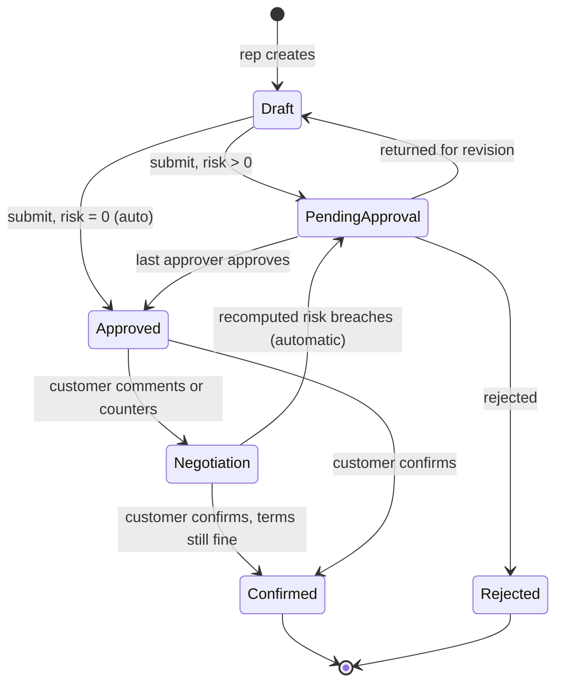
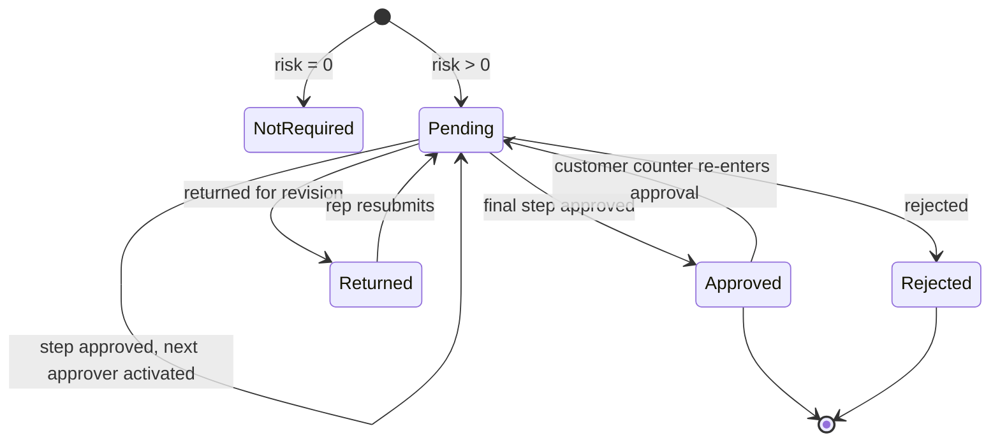
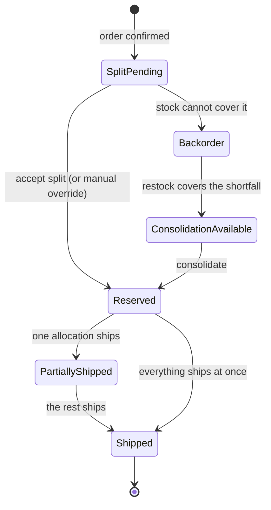
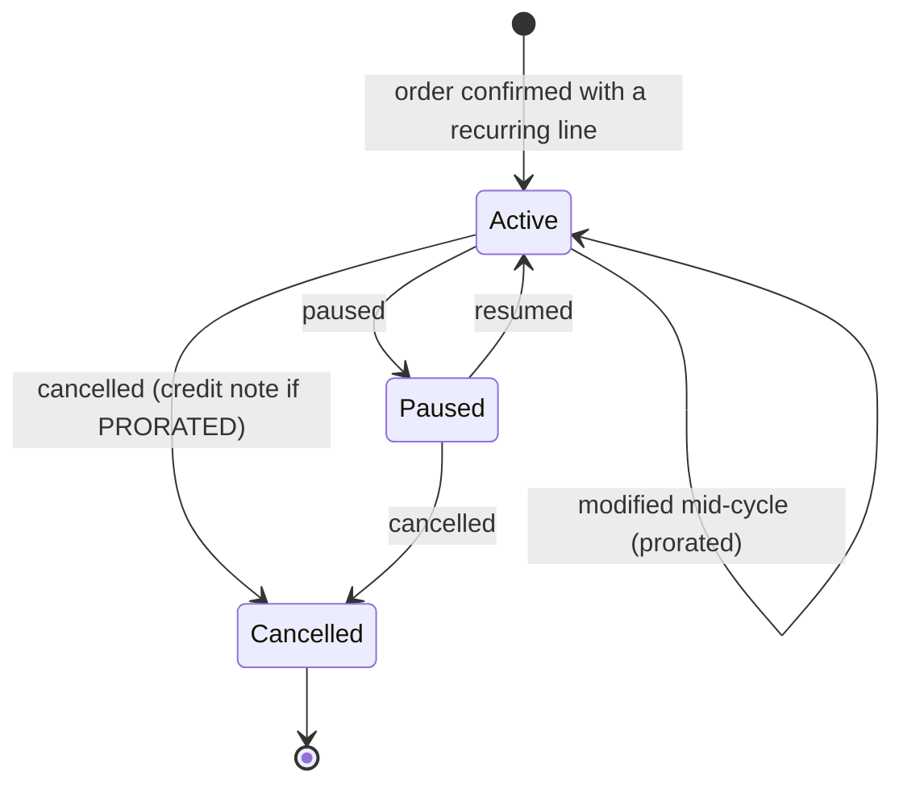
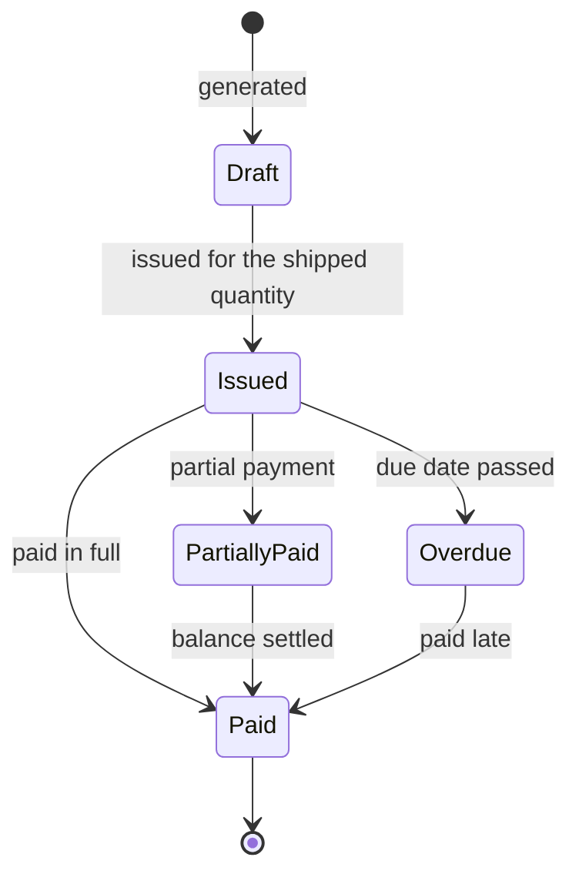

# User flows

The story of DealFlow360 from the outside. No code, no endpoints, no collection
names — only what a person sees, does and believes.

This is the second thing every agent reads, after `MASTER_SPEC.md`. It exists
because the demo is judged on narrative, not schemas, and because you cannot
build a screen well if you do not know what the person in front of it is trying
to accomplish.

Every value, label, status chip and button name below matches the running
application. The figures are the ones the seed actually computes — you can read
this document with the app open and never hit a mismatch.

**Cross-references:** the rule behind each behaviour is in
`BUSINESS_RULES.md`; the screen that renders it is in `UI_SPEC.md`.

---

## Contents

- [A. Cast of characters](#a-cast-of-characters)
- [B. First-run onboarding](#b-first-run-onboarding)
- [C. The golden path, click by click](#c-the-golden-path-click-by-click)
- [D. A day in the life, per persona](#d-a-day-in-the-life-per-persona)
- [E. Alternate and unhappy paths](#e-alternate-and-unhappy-paths)
- [F. Screen-to-journey map](#f-screen-to-journey-map)
- [G. State transitions in user language](#g-state-transitions-in-user-language)
- [H. The five-minute demo narration](#h-the-five-minute-demo-narration)

---

## A. Cast of characters

### J. Rao — Sales Rep
`rep@dealflow360.test` / `Demo@123` → lands on the **Sales Dashboard**

**Cares about:** closing deals without waiting on anyone, and knowing early when
a discount is going to cost him a day of approvals.

**Can see:** his own dashboard, every quotation, the quotation builder, live
stock, invoices, and Deal Health for the deals he owns.

**Can do:** create quotations, add and remove lines, set quantities and
line-level discounts, accept upsell suggestions, save drafts, submit for
approval, and respond to customer negotiation requests.

**Blocked from:** approving anything (including his own quotes), editing discount
ceilings, and the customer portal. If he types an approval URL directly he is
bounced with *"That area is limited to ADMIN, SALES_MANAGER, FINANCE. You are
signed in as SALES_REP."*

**Screens:** 1, 2, 3, 4, 7, 12, 13, 14

---

### S. Nair — Sales Rep (second)
`rep2@dealflow360.test` / `Demo@123` → lands on the **Sales Dashboard**

Identical permissions to J. Rao. **Exists for a reason:** the discount-anomaly
rule compares a quote against *the owning rep's own* trailing average, so it
needs a second rep with a different baseline to be meaningful. S. Nair averages
11% discount; J. Rao averages 8%. The same 32% quote is an anomaly for both, but
for different reasons — and a 24% quote would be an anomaly only for J. Rao.

**Screens:** same as J. Rao. Owns Beta Industries, Novus Retail and Orion Ltd.

---

### M. Shah — Sales Manager
`manager@dealflow360.test` / `Demo@123` → lands on the **Sales Dashboard**, with
a Pending Approvals count on the tile

**Cares about:** not reviewing every quotation by hand. The whole point of the
blended risk score is that only the deals that need judgement reach him.

**Can see:** everything a rep can, plus the approval queue, every approval's
flagged-lines table and audit trail, the Deal Health dashboard, reporting, and
the configuration area.

**Can do:** approve, return for revision, or reject any pending quotation;
nudge a rep or escalate an alert; change discount ceilings and the approval
chain on screen 18.

**Blocked from:** the customer portal.

**Screens:** 1, 2, 3, 4, 5, 6, 7, 9, 12, 14, 15, 16, 18

---

### K. Iyer — Finance
`finance@dealflow360.test` / `Demo@123` → lands directly on **Approvals**

**Cares about:** margin on the deals that reach the second approval step, and
keeping billing reconciled with what actually shipped.

**Can see:** approvals **that reached the Finance step** — the queue is scoped by
the API, not merely defaulted to a filter, so a quote the Sales Manager clears
alone never appears; quotations **from APPROVED onward** (approved, in
negotiation, confirmed), never drafts or rejects; fulfillment, subscriptions and
billing detail, invoices, reporting.

**Can do:** approve/return/reject at the Finance step, record payments, modify
and cancel subscriptions (which triggers proration and credit notes), accept or
override a warehouse split.

**Blocked from:** creating quotations — screen 3 hides **+ New Quotation** for
Finance rather than offering a button the API would refuse — and the customer
portal.

**Note:** Finance only ever sees a quotation *after* a Sales Manager has approved
it. On a HIGH-risk quote the Finance step stays inactive until then.

**Screens:** 1, 5, 6, 7, 8, 9, 10, 12, 13, 15

---

### A. Verma — Admin
`admin@dealflow360.test` / `Demo@123` → lands on the **Product Dashboard**

**Cares about:** the catalogue and the governance rules being right, because
everything downstream is derived from them.

**Can see and do:** products and variants, price lists, warehouses and
replenishment rules, subscription plans, and the discount tiers and approval
chain. Also platform-wide reporting.

**Blocked from:** the customer portal. (Admin *can* open the sales workspace —
useful for support, and for the demo.)

**Screens:** 1, 15, 16, 17, 18, plus the whole workspace

---

### Priya Menon — Customer at Acme Corp
`priya@acmecorp.test` / `Demo@123`, **or** the magic link
→ lands on **My Quotations**

**Cares about:** getting a straight answer on price without a chain of emails,
and being able to ask about one line without renegotiating the whole order.

**Can see:** exactly one thing — Acme Corp's quotations, all of them. The list
opens first; picking one shows its line items, quantities, her prices, her
discounts, the total, and that quotation's own message history.

**Can do:** comment on any line, propose a counter discount, request a different
delivery date, and confirm.

**Blocked from:** absolutely everything else. She cannot see margin, cost, the
risk score, who is approving, other customers, or any internal screen. Her
navigation has three items: **My Quotations · Messages · Profile**.

**The two credentials are scoped differently, on purpose.** Her password login
is scoped to *Acme Corp*, so it lists every quotation the company has been sent.
A magic link is scoped to the *one quotation it was minted for*, so the same list
shows a single row and says why.

**Screens:** 1, 11

---

### R. Das — Customer at Beta Industries
`das@betaindustries.test` / `Demo@123` → lands on **My Quotations**

**Exists to prove the boundary is real.** He is a legitimate, fully working
portal user for a *different* company. Sign in as him and try to open Acme's
quotation — by URL, or by pasting Priya's link — and both return
**403: "This quotation belongs to a different company."**

He is also the clearest demonstration that a customer is not a quotation: Beta
Industries has several, and his list shows all of them — one in negotiation, one
approved and waiting on him, one confirmed, one still inside internal approval —
with Acme's nowhere in sight.

**Screens:** 1, 11

---

### Permissions matrix

*allowed · **denied** · conditional*

| Action | Sales Rep | Sales Manager | Finance | Admin | Customer |
|---|---|---|---|---|---|
| Create a quotation | allowed | allowed | **denied** | allowed | **denied** |
| Change a line's discount | allowed | allowed | **denied** | allowed | **denied** |
| Submit a quotation for approval | allowed | allowed | **denied** | allowed | **denied** |
| Approve a quote over its discount limit | **denied** | allowed | *only at the Finance step, after the Manager* | **denied** | **denied** |
| Return a quote for revision | **denied** | allowed | allowed | **denied** | **denied** |
| Reject a quote outright | **denied** | allowed | allowed | **denied** | **denied** |
| See why a quote was flagged | allowed | allowed | allowed | allowed | **denied** |
| See margin and cost | allowed | allowed | allowed | allowed | **denied** |
| Change a discount ceiling | **denied** | allowed | **denied** | allowed | **denied** |
| Add or edit a product | **denied** | **denied** | **denied** | allowed | **denied** |
| Accept a suggested warehouse split | allowed | allowed | allowed | allowed | **denied** |
| Override a split manually | **denied** | allowed | allowed | allowed | **denied** |
| Record a payment | **denied** | allowed | allowed | allowed | **denied** |
| Cancel a subscription | **denied** | allowed | allowed | allowed | **denied** |
| Nudge a rep / escalate an alert | *own deals only* | allowed | **denied** | allowed | **denied** |
| Export a report | **denied** | allowed | allowed | allowed | **denied** |
| Open the customer portal | **denied** | **denied** | **denied** | **denied** | *own company only* |
| Comment on a quotation line | allowed | allowed | **denied** | **denied** | *own quotation only* |
| Counter a discount | **denied** | **denied** | **denied** | **denied** | *own quotation only* |
| Confirm a quotation | **denied** | **denied** | **denied** | **denied** | *own quotation only* |

---

## B. First-run onboarding

### What happens the very first time

Open `http://localhost:4200` and you land on **Sign in**. Two halves: the form on
the left, and on the right a dark **Demo accounts** panel listing all seven
personas. Each is a button — click one and you are signed in and on that
persona's own screen. No typing.

That panel is a demo accelerator, not a product feature. In a production build it
is not rendered at all, and the server refuses to list the accounts.

### Signing up for real

*Create one* opens a signup form: full name, email, password, and a **Team**
selector — Sales Rep, Sales Manager, Finance, Admin, or Customer.

Choosing **Customer** reveals a second field, **Company**, with the helper text:

> *"Your account will only ever be able to open this company's quotations."*

That is not a warning; it is the model. A customer account is scoped to exactly
one company, permanently.

After signup you are signed in and dropped on your role's landing screen.

### What the Admin must configure before anyone can quote

A rep cannot build a quotation against an empty catalogue, and no quotation can
be risk-scored without discount ceilings. In order:

1. **Products** (screen 16) — at least one active product with a price, a unit
   and a tax rate.
   *If missing:* "No products configured — A sales rep cannot build a quotation
   until the catalogue has at least one active product with a price and a tax
   rate." with a **+ New Product** button.
2. **Discount tiers and category ceilings** (screen 18).
   *If missing:* "Discount governance is not configured — Set the tier and
   category discount ceilings before any quotation can be risk-scored. Until then
   every quote routes to a Sales Manager by default." with **Save configuration**.
3. **Warehouses** — needed before an order can be split or reserved.
4. **Subscription plans** — needed before a recurring line can generate a
   schedule.

`npm run reset` does all four, so on a seeded environment none of these empty
states appear. They exist for the honest first-run case, and you can see them all
with `npm run reset -- --minimal`.

### Every empty state, verbatim

| Screen | Title | Body | Button |
|---|---|---|---|
| Quotations | No quotations yet | Quotations you create will appear here, grouped by stage. Start one to see live pricing, margin and risk as you build. | + New Quotation |
| Approvals | Nothing waiting on you | Quotations only land here when their blended risk score requires a human. An empty queue means every open deal is inside its discount limits. | — |
| Fulfillment | No orders awaiting fulfillment | Confirmed orders appear here with a suggested warehouse split. Confirm a quotation to see one. | — |
| Subscriptions | No subscriptions yet | Recurring lines on a confirmed order create a subscription with its own billing schedule, separate from the one-time invoice. | — |
| Invoices | No invoices yet | Invoices are raised against shipped quantities, so nothing is billed before it ships. | — |
| Deal Health | Every deal looks healthy | No stalled quotes, no discount anomalies and no delivery slippage against the current thresholds. | — |
| Products | No products configured | A sales rep cannot build a quotation until the catalogue has at least one active product with a price and a tax rate. | + New Product |
| Configuration | Discount governance is not configured | Set the tier and category discount ceilings before any quotation can be risk-scored. Until then every quote routes to a Sales Manager by default. | Save configuration |
| Portal | Nothing to review right now | When your account manager sends a quotation for review it will appear here, and you can comment on any line or counter the discount. | — |
| Audit trail | No activity recorded yet | Every approval, rejection, edit, discount change and negotiation event is logged here with who did it, when, and why. | — |

---

## C. The golden path, click by click

The complete arc, across five people. Every step: **what the user does → what
they see → what the system does → how they know it worked.**

### 1 — The Admin sets the governance rules

**Does:** signs in as **A. Verma**, opens **Discount Tiers & Approvals**
(screen 18). Sets Bronze 5%, Silver 10%, Gold 15%; Hardware 15%, Services 10%,
Subscription 5%. Types a reason and clicks **Save configuration**.

**Sees:** two panels of percentage fields; below them the approval-chain table —
*within limit → no approval needed; over limit, medium → Sales Manager; over
limit, high → Sales Manager then Finance*; and a highlighted row for the hard
escalation rule. Under the ceilings: *"A line's real limit is the **stricter** of
its tier ceiling and its category ceiling. A Gold customer at 15% buying a
Service capped at 10% is allowed 10%, not 15%."*

**System:** stores the configuration, then immediately re-prices and re-scores
every open quotation against the new numbers, closing any pending approval that
is no longer needed. Writes one audit entry with before, after and the reason.

**Knows it worked:** a toast — *"Configuration saved"* — and, underneath the
form, a **What that change did** panel listing every quotation that moved, with
its old score, its new score, and whether it still needs a human.

> Rules: `BUSINESS_RULES.md` §1, §8 · Screen: `UI_SPEC.md` screen 18

---

### 2 — The Admin stocks the warehouses

**Does:** opens **Warehouses**.

**Sees:** Main Warehouse (shipping weight 1.0, $24 base + $1/unit, 5-day lead
time) and East Depot (weight 1.4, $20 base + $1/unit, 9-day lead time).

**System:** these are the numbers the split planner ranks on. Lower weight wins;
the cost fields produce the estimate shown to operations.

**Knows it worked:** the Fulfillment screen shows live availability — Laptop Pro
14: Main **18** available, East Depot **6**.

---

### 3 — J. Rao opens his workspace

**Does:** signs in as **J. Rao**.

**Sees:** *"Good to see you, J. Rao"* and three tiles — **Pending Approvals 3**,
**Open Quotations**, **At-Risk Deals 8**. Beneath, his own quotations and a
Recent Activity feed. Two buttons: **+ New Quotation**, **View Approvals**.

**System:** every tile is a live count, not a constant.

**Knows it worked:** the tiles are clickable and go where they say.

---

### 4 — He opens Q-1042 for Acme Corp

**Does:** clicks **Quotations**, then the **Acme Corp** card in the *Pending
Approval* column.

**Sees:** the Kanban board — **Draft · Pending Approval · Approved · Negotiation
· Confirmed** — with a card per deal showing customer, amount and a risk chip.
Clicking opens the builder.

**System:** the board groups by stage and totals each column.

---

### 5 — The builder, and the line that breaks its limit

**Sees** (screen 4) — Q-1042 · Acme Corp, chips for *Pending Approval* and
*Gold*, and the line table:

| Product | Qty | Price | Discount | Limit | Status | Total |
|---|---|---|---|---|---|---|
| Laptop Pro 14 | 2 | $1,080.00 | 12% | 15% | **OK** | $2,185.92 |
| Onsite Setup Service | 1 | $405.00 | 18% | 10% | **OVER (+8pt)** | $381.92 |

The over-limit row is tinted. Under the table:

> *"Each line's discount is checked against **its own** limit — the stricter of
> the customer's tier ceiling and the product category's ceiling — as soon as you
> enter it, not only when you submit."*

The right column shows **Live totals** ($2,567.84), a **Margin** block
($412.90, 18.5%) coloured by health, a **Blended risk** card, and the **Upsell
and cross-sell suggestions** panel.

*(Laptop Pro 14 lists at $1,200 in the catalogue; Acme is Gold, and the Gold
price list is "base minus 10 percent", so Acme's price is $1,080. The risk score
is unaffected — see `BUSINESS_RULES.md` §1, "invariant to a uniform price-list
discount".)*

---

### 6 — He accepts an upsell and watches the margin move

**Does:** in the suggestions panel, clicks **Add to Quote** on **Care Plan 2yr
(Margin +$46)**.

**Sees:** the line appears in the table with a small *from upsell* badge. The
**Margin** figure moves in the *same frame* — no spinner, no reload. The total,
the tax and the recurring subtotal all update at once.

**System:** adding a suggestion is an ordinary line-add. Totals, margin and the
risk preview are all recalculated synchronously by the same pure functions the
server uses on save, so the preview cannot disagree with what gets stored.

**Knows it worked:** the numbers changed as he clicked.

> Rules: `BUSINESS_RULES.md` §5

---

### 7 — He discounts the setup service, and the line flips

**Does:** types `18` into the Onsite Setup Service discount field and tabs out.

**Sees:** the moment focus leaves the field, the Status cell flips from **OK** to
**OVER (+8pt)**, the row tints red, and the **Blended risk** card changes to
**HIGH · 33** with the sentence:

> *"1 of 2 lines exceed their own limit. Worst line is "Onsite Setup Service" at
> 8 points over (18% given, 10% allowed). Blended risk score 33 → HIGH. A single
> line is 8 points over, at or above the 8-point hard escalation limit, so this
> quotation is HIGH risk regardless of its score."*

Below it, an amber note: *"Submitting now routes to SALES_MANAGER, then FINANCE."*

**System:** Gold allows 15%, but Services allows only 10%, and the stricter wins.
18 − 10 = 8 points over.

**Knows it worked:** he knows what will happen *before* he submits. That is the
point — the system is not sandbagging him with a surprise.

---

### 8 — He submits, and the system intercepts by itself

**Does:** clicks **Submit for Approval**, expecting nothing.

**Sees:** the quotation moves to **Pending Approval** and a message confirms it
has been routed to a Sales Manager, then Finance.

**System:** recomputes the blended risk server-side, gets 33 → HIGH, creates an
approval with two steps — Sales Manager (active) and Finance (waiting) — and
writes an audit entry: *J. Rao / Submitted / "Initial 12% discount"*.

**Knows it worked:** the stage chip changed, and it appears in M. Shah's queue.
**J. Rao never asked for an approval.** The system decided.

> Rules: `BUSINESS_RULES.md` §1, §7

---

### 9 — M. Shah sees it waiting

**Does:** signs in as **M. Shah**, clicks **Approvals**.

**Sees:** chips — **3 Pending · 1 Returned · 12 Approved** — and a table:

| Quotation | Customer | Blended Risk | Stage | Assigned To |
|---|---|---|---|---|
| Q-1042 | Acme Corp | **HIGH** · 33 | Sales Manager | M. Shah |
| Q-1039 | Beta Industries | **MEDIUM** · 24 | Sales Manager | M. Shah |
| Q-1046 | Orion Ltd | **HIGH** · 41 | Finance | K. Iyer |

A **Pending Only** filter sits above.

---

### 10 — He reads *why*

**Does:** clicks the Q-1042 row.

**Sees** (screen 6) — badges **Blended Risk: HIGH** and **Customer Tier: GOLD**;
a stepper *Submitted → Sales Manager → Finance → Confirmed* with Sales Manager
active; and the table that does the persuading:

**Why This Quote Was Flagged** — score 33

| Line | Discount Given | Limit Allowed | Over By | Weight |
|---|---|---|---|---|
| Laptop Pro 14 / Hardware | 12% | 15% | 0 pt OK | 84% |
| Onsite Setup Service / Services | 18% | 10% | **8 pt OVER** | 16% |

> *"The worst single line over its limit, plus the revenue-weighted pattern
> across the whole order, together set the blended score. One bad line is enough
> to require approval — and many small ones are too."*

Beneath: the audit trail, and three buttons — **Approve** (green), **Return for
Revision** (amber), **Reject** (red).

**System:** every number in that table was produced by the risk engine at submit
time and is stored on the approval. The screen renders it verbatim; it does not
recompute a single figure.

**Knows it worked:** he can see the reasoning, not a score.

---

### 11 — He returns it for revision

**Does:** clicks **Return for Revision**. A dialog appears: *"Q-1042 goes back to
J. Rao as a draft. They will see your reason and can resubmit."* He types
`Requested justification` and confirms.

**Sees:** the quotation leaves his queue; the audit trail gains a row.

**System:** the approval status becomes Returned, the quotation goes back to
Draft, and an audit entry is written with actor, role, reason and timestamp. The
dialog told him it would: *"This is written to the audit trail with your name and
the time."*

**Knows it worked:** *M. Shah / Returned / "Requested justification"* is now the
second row of the trail.

---

### 12 — J. Rao adds a note and resubmits

**Does:** signs back in as J. Rao, opens Q-1042 (now a draft), adds a margin note
and clicks **Submit for Approval**.

**System:** risk is recomputed from scratch — still 33 — and the approval
reopens at the Sales Manager step. Third audit entry:
*J. Rao / Resubmitted / "Added margin note"*.

**Knows it worked:** the audit trail now reads exactly:

| User | Action | Date | Reason |
|---|---|---|---|
| J. Rao | Submitted | Aug 20 | Initial 12% discount |
| M. Shah | Returned | Aug 21 | Requested justification |
| J. Rao | Resubmitted | Aug 22 | Added margin note |

---

### 13 — M. Shah approves, and it moves to Finance

**Does:** approves with a reason.

**Sees:** the stepper advances — Sales Manager turns green, **Finance** becomes
active, *Assigned To* changes to K. Iyer. The quotation is **not** approved yet.

**System:** the chain advances one step. A HIGH-risk quote needs both.

---

### 14 — K. Iyer approves, and it reaches the customer

**Does:** signs in as **K. Iyer** — who lands *directly* on Approvals, because
that is where Finance works — opens Q-1042 and approves.

**Sees:** the stepper completes and the stage becomes **Approved**.

**System:** the approval closes, the quotation moves to Approved, and the
customer's portal link becomes live.

---

### 15 — Priya opens her link

**Does:** clicks the link her account manager sent, or signs in as
`priya@acmecorp.test`.

**Sees:** a completely different surface. A light header, three tabs — **My
Quotation · Messages · Profile** — and her quotation: line items, quantities, her
prices, her discounts, the total. **No margin. No cost. No risk score. No mention
of who approved it.** Below each line, a comment box and a counter-discount
field. Then:

> *"You can comment on any line or propose a different discount. If the final
> terms go beyond what your account manager can approve on their own, the
> quotation goes back for internal approval automatically — you will see the
> status change here."*

**System:** her link is bound to one quotation and one company. Her password
login is scoped to Acme Corp. There is no navigation from here into the internal
app, because there is no route.

---

### 16 — She counters

**Does:** types *"Can this be 15% off instead of 10%?"* against the Extended
Warranty line, enters `15` in its counter field, raises the laptop quantity for
the wider rollout, and clicks **Submit Request**.

**Sees:** a confirmation, and the status chip changes to **Negotiation**.

**System:** records each comment and counter, applies the proposed terms, and
**recomputes the blended risk**.

---

### 17 — The quote re-enters approval by itself

**Sees:** *"Your proposal goes beyond what your account manager can approve
alone, so it has gone back for internal approval automatically."*

**System:** the recomputed risk still breaches the thresholds, so the quotation
is forced back to **Pending Approval** with the audit reason
*re-entered from negotiation*. **Nobody requested this review.** In M. Shah's
queue it reappears, and on the approval screen a blue panel reads:

> *"**Back from the customer** — The customer changed the terms in the portal and
> the quotation re-entered approval by itself. Nobody asked for this review."*

**Knows it worked:** Priya sees "Negotiation"; M. Shah sees the quote back in his
queue without having done anything. **This is the single most impressive moment
in the demo — rehearse it.**

> Rules: `BUSINESS_RULES.md` §7 "The re-approval loop"

---

### 18 — Re-approved, and Priya confirms

**Does:** M. Shah and K. Iyer approve the new terms. Priya refreshes and clicks
**Confirm Quotation** (green).

**System:** the quotation becomes **Confirmed**, an order is created from it, and
the split planner runs against live stock.

---

### 19 — The order splits itself across two warehouses

**Does:** K. Iyer opens **Fulfillment** and clicks the new order.

**Sees** (screen 8):

| Warehouse | Qty Fulfilled | Est. Shipments | Cost |
|---|---|---|---|
| Main Warehouse | 18 units | 1 | $42.00 |
| East Depot | 6 units | 1 | $26.00 |
| **Total** | **24 units** | **2** | **$68.00** |

And, in a side panel, **Why this split** — in plain English:

> No single warehouse can cover the whole order (24 units across 1 line), so the
> order is being split. · Warehouses ranked by (lines fully coverable DESC,
> shipping cost weight ASC): Main Warehouse [weight 1] > East Depot [weight 1.4].
> · Main Warehouse covers a partial remainder of 18 units. · East Depot covers a
> partial remainder of 6 units. · Final plan: 2 warehouses, 2 shipments,
> estimated cost 6800 minor units, 0 units on backorder.

Two buttons: **Accept Suggested Split** and **Manual Override**.

**System:** Main has 18 available and East 6; the order needs 24. Main is
preferred because its shipping cost weight is lower. Accepting reserves the stock
atomically, so availability drops the moment it is accepted.

**Knows it worked:** the numbers add up, the reasoning is on screen, and the
stock figures on screen 7 move.

> Rules: `BUSINESS_RULES.md` §3

---

### 20 — One order, two billing artefacts

**Does:** opens **Invoices**, then **Subscriptions**.

**Sees:** the order produced **both**:

- an **invoice** for the one-time hardware and services — raised only for what
  actually shipped
- a **subscription** for Care Plan 2yr, Monthly, with its own generated schedule
  and a next bill date, invoiced at the *beginning* of each period

Screen 13 shows both against the same order, and screen 10 shows them side by
side: *One-Time Lines (from the originating order)* above *Recurring Lines*.
Neither list ever contains the other's items.

**System:** confirmation splits the order. One-time lines are invoiced against
shipped quantity; recurring lines generate a schedule.

> Rules: `BUSINESS_RULES.md` §4

---

### 21 — Finance records the payment

**Does:** opens the unpaid invoice, clicks **Record Payment**, enters the amount
and a reference, confirms.

**Sees:** the status chip flips to **Paid**, the outstanding balance goes to
zero, the payment appears in the list, and the stepper advances:
**Order Confirmed → Shipped → Invoiced → Paid**.

---

### 22 — M. Shah catches a stalling deal

**Does:** opens **Deal Health**.

**Sees:** three tiles — **Stalled Deals 5**, **Discount Anomalies 2**, **Delivery
Slippage 1** — and a table:

| Deal | Issue | Flagged | Owner | Action |
|---|---|---|---|---|
| Q-1030 | idle 9 days | *(yesterday)* | J. Rao | Nudge sent |
| Delta LLC | discount 32% vs avg 8% | *(yesterday)* | J. Rao | Escalated to Manager |

Clicking a deal opens the quotation. Open alerts offer **Nudge Rep** and
**Escalate**.

**Does:** clicks **Nudge Rep** on a stalled deal.

**System:** notifies the owning rep and writes an activity plus an audit entry.

**Knows it worked:** the row's action column changes to *Nudge sent*.

> Rules: `BUSINESS_RULES.md` §6

---

## D. A day in the life, per persona

### J. Rao — Sales Rep

Signs in and lands on the dashboard. Three tiles tell him what needs him.

**Starts a quote.** Quotations → **+ New Quotation** → picks a customer. Their
tier and price list come with them; every product he adds is priced accordingly.

**Builds the cart.** Adds products, sets quantities. Totals and margin move on
every keystroke.

**Works the upsell panel.** Three ranked suggestions with their margin delta and
any promo tag. **Add to Quote** or **Dismiss**. Adding one moves the margin
immediately.

**Applies discounts.** Each line shows its own **Limit** next to the discount he
typed, and flips to **OVER (+Npt)** the moment he exceeds it. He always knows
whether he is about to trigger an approval.

**Saves a draft and comes back.** *Save Draft* keeps the stage at Draft; the deal
sits in the Draft column and on his dashboard. Reopening restores everything —
and if the Admin changed a ceiling meanwhile, the limits and statuses are
*already* recalculated against the new rules.

**Submits.** If every line is inside its limit, the quote is auto-approved and
goes straight to the customer. If not, it routes itself.

**Handles a return.** A returned quote appears back in Draft with the manager's
reason. He fixes it and resubmits; the audit trail keeps every round.

**Responds to negotiation.** When a customer comments, it appears against the
line. He replies, or adjusts and resubmits.

**Watches his own deals.** Deal Health flags his stalled quotes before his
manager asks.

---

### M. Shah — Sales Manager

**Triages.** Approvals with **Pending Only** on. He reads *Blended Risk* first
and *Stage* second, and only opens what needs judgement.

**Reviews.** The flagged-lines table tells him which line broke which limit and
by how much, weighted by revenue. Then the audit trail: who did what, when, why.

**Decides.** Approve, Return for Revision, or Reject — each requires a reason,
each is logged, and the dialog says exactly what happens next.

**Changes a ceiling.** Screen 18: raises Services from 10% to 20% with a reason.
Saves. A panel appears listing every open quotation that was re-scored — which
ones dropped a band, which stopped needing approval at all. He watches the queue
shrink.

> Note the subtlety: raising *only* the Services ceiling leaves the Gold tier's
> 15% binding, so an 18% service line is still 3 points over — the quote drops
> from HIGH to MEDIUM rather than clearing. To clear it he raises the Gold tier
> too. This is the "stricter of the two" rule doing its job.

**Watches Deal Health.** Nudges a rep on a stalled deal; escalates a discount
anomaly.

**Reads reports.** Filters by Period, Sales Rep, Approval Status and Product to
see who is discounting hardest and how long approvals are taking.

---

### K. Iyer — Finance

**Lands on Approvals.** Finance is where the day starts; only second-step quotes
reach here.

**Approves at the Finance step.** Reads the same flagged-lines table, with an
eye on margin.

**Handles fulfillment.** Reviews suggested splits, accepts them, or overrides
with a reason when a customer needs everything in one shipment.

**Reconciles billing.** Confirms that the one-time invoice matches shipped
quantity and that recurring schedules are running.

**Cancels a subscription mid-cycle.** Screen 10 → **Cancel Subscription**. The
dialog explains: *"Cancelling stops the schedule and settles the current period
under the configured cancellation rule. Under PRORATED, a credit note is issued
for the unused days."* He confirms with a reason, and a credit note for the
unused portion appears against the customer.

**Records payments.** Status and the order stepper both advance.

---

### A. Verma — Admin

**Manages the catalogue.** Screen 16 shows Total Products, Pricelists and
Variants, then the table. Clicking a product opens screen 17: General Info,
Product Variants, Pricelists.

**Adds a variant.** In Product Variants, adds an attribute (say *RAM*) with its
values and their extra prices (*4GB +$0, 8GB +$30*). The Variants tile on screen
16 recounts, because it multiplies out the value combinations.

**Adds a price-list rule.** Sets Gold to *base minus 10 percent* across USD and
EUR. Every Gold customer's quotation lines now price accordingly. This is
*pricing*, and is deliberately separate from the tier's *discount ceiling*.

**Sets up warehouses and plans.** Shipping cost weights, base and per-unit costs,
lead times, reorder points; then the recurring plans with their proration and
cancellation rules.

**Owns governance.** Screen 18, and the same live re-evaluation the manager sees.

---

### Priya Menon — Customer

**Arrives** by link or by signing in. Sees her quotation and nothing else.

**Asks a question without countering.** Types *"Does this include on-site
installation?"* against a line and submits, leaving the counter field empty.
Nothing about the price changes, the quote does **not** re-enter approval, and
her question appears in Messages awaiting a reply.

**Counters a discount.** Enters a percentage against a line, optionally requests
a delivery date, and submits. The banner already told her what may happen next.

**Watches the status.** *Under Negotiation* while the ball is with the rep. If
her terms triggered a re-approval, she sees that in the message she gets back.

**Confirms.** One green button. From there the order is prepared, and she is told
she will get an invoice once it ships.

**Checks Messages and Profile.** The whole conversation in order; and a Profile
that states plainly: *"This account can only open quotations belonging to your
company."*

---

## E. Alternate and unhappy paths

### E1 — The quote is rejected outright

**M. Shah** clicks **Reject**. The dialog warns: *"Q-1042 is closed for good. The
rep would have to start a new quotation."* He gives a reason and confirms.

**What the rep sees:** the quotation is **Rejected**, out of the pipeline, with
the reason in the audit trail. **What he can do next:** start a new quotation. A
rejection is terminal on purpose.

---

### E2 — No approval needed at all

J. Rao builds a quote where every line is inside its own limit. The **Blended
risk** card reads **LOW · 0**, and the note below is green: *"Submitting now
would go straight to the customer — no approval needed."*

He submits. The quote goes straight to **Approved** and the portal link is live
immediately. In the approvals list it appears as **Auto-Approved** with nobody
assigned, and the audit trail records *"Blended risk score 0 — no approval
required."* **Q-1035 (Novus Retail) is seeded in exactly this state.**

---

### E3 — The customer confirms without negotiating

Priya opens her link, reads the quotation, and clicks **Confirm Quotation**
without touching a comment or counter field.

Nothing is recomputed, because nothing changed. The quote goes straight to
**Confirmed**, an order is created, the split runs, and billing generates. No
second approval, because the terms are the ones that were already approved.

---

### E4 — Not enough stock: part of the order backorders

An order needs 30 units; 24 are available across both warehouses.

Operations sees Main 18 + East 6 allocated, and a **Backorder** section:

| Product | Qty | Expected from | ETA |
|---|---|---|---|
| Laptop Pro 14 | 6 | Main Warehouse | *(5 days out)* |

The order's status chip reads **Backorder**. The ETA comes from whichever
warehouse restocks that product soonest — Main's 5-day lead time beats East's
9-day. On screen 7 the order appears under *Orders Awaiting Fulfillment* with the
same status. **ORD-1032 (Zenith Co) is seeded in this state.**

---

### E5 — Stock arrives, and the consolidation prompt appears by itself

Later, East Depot restocks and now covers the outstanding 6 units. Nobody clicks
anything.

Next time operations opens the fulfillment, a blue banner is at the top:

> **Consolidate Remaining Backorder** — *"Stock arrived and now covers the
> outstanding backorder. You can ship the remainder as one consolidated shipment
> instead of leaving it open."* — with a **Consolidate** button.

**What they can do next:** consolidate, or leave it and ship separately.

---

### E6 — Operations rejects the split and overrides it

A customer needs everything in one delivery. Operations clicks **Manual
Override** instead of accepting.

The dialog: *"A manual allocation is validated against live availability and is
written to the audit trail with your reason."* A reason is mandatory.

**System:** validates the manual allocation against real availability — an
override cannot conjure stock that does not exist — reserves accordingly, and
records who overrode it and why. The fulfillment then carries a **Manually
overridden** chip, and the *Why this split* panel gains an *Overridden by* block
with the reason.

**If it does not validate:** the allocation is refused with a message naming the
product and warehouse that came up short. The suggested split stands.

---

### E7 — Delivery slips past the promise

An order was promised for the 10th; the backorder ETA now projects the 18th.

Deal Health's **Delivery Slippage** tile counts it, and the table shows
*"delivery 8 day(s) late"*. Clicking opens the deal. The manager can nudge or
escalate. Nobody had to notice manually.

---

### E8 — A discount anomaly is escalated

J. Rao's quote for Delta LLC averages 32% discount. His own trailing average is
8%.

Deal Health flags it: **Delta LLC · discount 32% vs avg 8%**, severity high —
because it is both more than twice his norm *and* over the absolute cap. The
manager clicks **Escalate**, and the row's action column reads *Escalated to
Manager*.

The comparison is against **J. Rao's own** average. The same 32% quote from
S. Nair (who averages 11%) is still flagged, but by the absolute cap rather than
the multiplier — and a 24% quote from S. Nair would not be flagged at all.

---

### E9 — The portal link has expired

Priya clicks an old link.

She sees a calm amber panel: **"This link has expired"**, the explanation, and:
*"Ask your account manager to send you a fresh link, or sign in with the account
they set up for you."*

No stack trace, no blank page, no login loop. **What she can do next:** sign in
with her password, which works and shows the same quotation.

*(Seeded: token `demo-acme-q1042-expired-000000000`.)*

---

### E10 — A customer opens someone else's quotation

**R. Das** (Beta Industries) signs in and tries to open Acme's quotation — by
guessing the URL, or by pasting Priya's link.

He sees: **"This quotation is not yours"** — *"This quotation belongs to a
different company."*

It fails identically both ways, because the scope check is on the server, not in
the link. An internal user's session is refused too: the portal is a different
surface with a different credential, not an internal screen with a different
header.

---

### E11 — A rep opens a screen they have no rights to

J. Rao types `/app/approvals` into the address bar.

He never sees the screen. A toast appears — *"You do not have access to that
screen — That area is limited to ADMIN, SALES_MANAGER, FINANCE. You are signed in
as SALES_REP."* — and he is redirected to his own dashboard. Told what happened
and why, not dumped on an error page.

---

### E12 — The network drops mid-save

The API stops responding while a save is in flight.

A toast appears: **"Cannot reach the server"** — *"The API is not responding.
Check that `npm run dev:api` is running, or switch on mock mode in
environment.ts."*

**What is not lost:** the builder's working copy lives in the browser. Totals,
margin and risk keep recalculating locally, because those are computed in the
browser from the same rules the server uses. Nothing is silently discarded.
When the API returns, saving again works. If someone else changed the quotation
meanwhile, the save is refused with *"This record changed while you were editing
it. Reload and try again."* rather than overwriting their work.

---

### E13 — The session expires

A token ages out. The next request returns 401.

The session is cleared, the user goes to the sign-in screen, and an amber note
reads *"Your session ended. Please sign in again."* After signing in they are
returned to the page they were on.

---

### E14 — The Admin has not configured governance yet

A brand-new environment with no ceilings saved.

Screen 18 shows: *"Discount governance is not configured — Set the tier and
category discount ceilings before any quotation can be risk-scored. Until then
every quote routes to a Sales Manager by default."*

Quotations can still be built, but the system errs on the side of review rather
than silently approving everything.

---

## F. Screen-to-journey map

| # | Screen | Who reaches it | Comes from | Leads to | What they are trying to do | The one thing it must make obvious |
|---|---|---|---|---|---|---|
| 1 | Login / Signup | everyone | the URL | 2, 5, 11, 16 | Get in as themselves | Which persona you are about to become |
| 2 | Sales Dashboard | Rep, Manager, Admin | 1 | 3, 4, 5, 14 | Find out what needs them today | The three counts, and that they are clickable |
| 3 | Quotations (list) | Rep, Manager, Admin | 2 | 4 | Find a deal, or start one | Where every deal is in the flow |
| 4 | Quotation Detail | Rep, Manager | 3, 14 | 5, 11 | Build a quote and know what it will trigger | **OVER (+Npt)** the instant a discount breaks its limit |
| 5 | Approvals (list) | Manager, Finance, Admin | 2 | 6 | Triage what needs judgement | Blended Risk, and who is holding the ball |
| 6 | Approval Detail | Manager, Finance | 5 | 4, 5 | Decide, with evidence | **Why This Quote Was Flagged** — the line, the limit, the overage |
| 7 | Fulfillment and Stock | Finance, Manager, Admin | nav | 8 | See real availability and what is waiting | Available = in stock − reserved, and it moves |
| 8 | Fulfillment Detail | Finance, Manager | 7 | 7 | Accept or override a split | The **rationale** — the split is reasoned, not guessed |
| 9 | Subscriptions | Finance, Manager, Admin | nav | 10 | See what is recurring | Active / Paused / Cancelled at a glance |
| 10 | Billing Detail | Finance, Manager | 9 | 12 | Reconcile hybrid billing | One-time and recurring, side by side, never mixed |
| 11 | Customer Portal | Customer only | link or login | — | Understand, negotiate, confirm | That a counter may send it back for approval |
| 12 | Invoices | Finance, Manager, Admin | nav | 13 | Find what is unpaid | Unpaid vs Paid |
| 13 | Invoice Detail | Finance, Manager | 12 | 12 | Record a payment | The stepper: Confirmed → Shipped → Invoiced → Paid |
| 14 | Deal Health | Manager, Rep, Admin | 2 | 4 | Catch trouble early | Three tiles, and that clicking opens the deal |
| 15 | Reporting | Admin, Manager, Finance | nav | — | Understand performance | Quotes Created, Avg Approval Time, Top Upsell |
| 16 | Product Dashboard | Admin, Manager | 1 | 17 | Manage the catalogue | Active vs archived, tiers, SKUs |
| 17 | Product Details | Admin | 16 | 16 | Configure one product | Subscription Yes/No, and its recurring cycle |
| 18 | Discount Tiers & Approvals | Admin, Manager | nav | 5 | Set the rules everything obeys | The stricter of tier and category always wins |

---

## G. State transitions in user language

### Quotation

| State | What the user believes right now | Trigger | Who caused it |
|---|---|---|---|
| **Draft** | "It's mine. Nobody has seen it." | created, or returned for revision | the rep, or a manager returning it |
| **Pending Approval** | "It's out of my hands. Someone has to look at it." | submitted and the risk score was non-zero | the *system*, not the rep |
| **Approved** | "It's cleared internally. The customer can see it." | the last approver approved, or risk was 0 | the final approver, or the system |
| **Negotiation** | "The customer has the ball and the rep is waiting." | the customer commented or countered | the customer |
| **Confirmed** | "It's a real order now." | the customer clicked Confirm | the customer |
| **Rejected** | "It's dead. Start again." | an approver rejected it | an approver |

### Approval

| State | What the user believes | Trigger | Who |
|---|---|---|---|
| **Auto-Approved** | "Nobody needed to look at this." | risk score 0 | the system |
| **Pending** | "It is sitting with whoever is named in Assigned To." | submitted, or re-entered from negotiation | the rep, or the system |
| **Returned** | "The rep has it back, and knows why." | returned for revision | an approver |
| **Approved** | "Everyone who had to sign off has." | the last step approved | the final approver |
| **Rejected** | "Closed. Not coming back." | rejected | an approver |

### Fulfillment

| State | What the user believes | Trigger | Who |
|---|---|---|---|
| **Split Pending** | "Here's the plan. I haven't committed to it." | the order was confirmed | the system |
| **Reserved** | "The stock is ours. Availability has dropped." | Accept Suggested Split, or an override | operations |
| **Backorder** | "Some of it isn't here yet, and I know when it will be." | live stock could not cover the order | the system |
| **Consolidation Available** | "Stock arrived. I can ship the rest in one go." | a restock covered the shortfall | the system |
| **Partially Shipped** | "Some has gone. That part can be invoiced." | an allocation shipped | operations |
| **Shipped** | "All of it has gone." | every allocation shipped | operations |

### Subscription

| State | What the user believes | Trigger | Who |
|---|---|---|---|
| **Active** | "It's billing on schedule. There's a next bill date." | created from a confirmed recurring line | the system |
| **Paused** | "It's not billing right now, and there's no next date." | paused | Finance or a manager |
| **Cancelled** | "It's over. Any refund has been settled." | cancelled | Finance or a manager |

### Invoice

| State | What the user believes | Trigger | Who |
|---|---|---|---|
| **Draft** | "Not sent yet." | created | the system |
| **Unpaid** | "The customer owes this." | issued | the system |
| **Partially Paid** | "Some has come in; there's a balance." | a payment less than the total | Finance |
| **Paid** | "Settled." | payments cover the total | Finance |
| **Overdue** | "It's late." | the due date passed unpaid | time |

---

## H. The five-minute demo narration

Full speaker script, with timings, logins and fallbacks, in
**`docs/DEMO_SCRIPT.md`**. In outline:

| Time | Who | Beat | The sentence |
|---|---|---|---|
| 0:00–0:20 | — | Open | "Most sales tools take a quote to an invoice. This one governs the deal while it's happening." |
| 0:20–1:00 | J. Rao | Build, upsell, discount | "I add the care plan and the margin moves in the same instant. Now watch this line the moment I discount it 18%." |
| 1:00–1:20 | J. Rao | Submit | "I never asked for an approval. It intercepted the quote by itself." |
| 1:20–2:10 | M. Shah | The flagged table | "It doesn't just say HIGH. It says which line, which limit, and by how much." |
| 2:10–2:35 | M. Shah, K. Iyer | Return, resubmit, two approvals | "Every round is in the audit trail with a name, a time and a reason." |
| 2:35–3:20 | Priya | Portal + counter | "Different login, different surface, and she can't see margin, cost or risk." |
| 3:20–3:40 | M. Shah | **The re-approval loop** | "**Nobody requested that review. The quote put itself back in the queue.**" |
| 3:40–4:10 | Priya, K. Iyer | Confirm, split, hybrid billing | "One order, two billing artefacts — and here's *why* it split that way." |
| 4:10–4:30 | K. Iyer | Record payment | "Nothing is billed before it ships." |
| 4:30–4:50 | A. Verma | Change a ceiling live | "Same quote, score 33 to 0, approval gone. Nothing here is hardcoded." |
| 4:50–5:00 | M. Shah | Deal Health + close | "And it watches the deals nobody is looking at." |

The eight judging moments, and the fallback line for each if a step misbehaves,
are in `DEMO_SCRIPT.md`.
